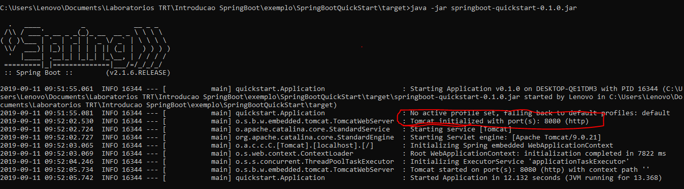

## Introdução ao SpringBoot

### Material de preparação
[Introdução conceitual ao SpringBoot](https://www.tutorialspoint.com/spring_boot/spring_boot_introduction.htm)<br/>
[Introdução prática ao SpringBoot](https://spring.io/guides/gs/spring-boot/)

### Introdução
O SpringBoot é um framework desenvolvido para fornecer uma forma fácil e prática de criar e configurar rapidamente uma aplicação de microserviços baseada em Spring.<br/>
 
Neste laboratório iremos realizar uma breve introdução ao SpringBoot, caso queira se aprofundar melhor na tecnologia SpringBoot recomendamos este [site](https://www.baeldung.com/spring-boot),
 além dele recomendamos também este [site](https://spring.io/guides/) que possui diversos tutorias de uso da tecnologia Spring.

Criaremos neste laboratório um exemplo simples de um controller Rest com SpringBoot.

### Criando a aplicação.
Conforme foi abordado no material de preparação o SpringBoot pode ser utilizado com [maven](https://maven.apache.org/) ou [gradle](https://gradle.org/).<br/>
Abordaremos aqui seu uso utilizando a tecnologia maven.

Primeiro iremos criar a estrutura de pastas de nosso projeto, normalmente essa estrutura de pastas de um projeto SpringBoot é algo semelhante a isso:<br/>
```java
└── src
    └── main
    |    └── java
    |    └── resources
    └── test
        └── java
```
Explicando a estrutura de diretórios:
 * **src/main/java/**: Este diretório armazena classes e pacotes de um projeto SpringBoot.
 * **src/main/resources**: Normalmente esta pasta é utilizada para armazenar os [resources](http://makble.com/what-is-the-srcmainresources-folder-for-in-java-project) 
 de nossa aplicação.
 * **src/test/java/**: Este diretório armazena classes e pacotes utilizados para testar nossa aplicação, por exemplo: classes de testes de unidade serão armazenadas neste diretório.

Crie uma pasta chamada SpringBootQuickStart e dentro dela crie a seguinte estrutura de pastas:<br/>
```java
└── src
    └── main
    |    └── java
    |        └── quickstart
    └── test
        └── java
            └── quickstart
```


Em nossa pasta raiz crie um arquivo chamado pom.xml e introduza nele o seguinte conteúdo:<br/>
```xml
<?xml version="1.0" encoding="UTF-8"?>
<project xmlns="http://maven.apache.org/POM/4.0.0" xmlns:xsi="http://www.w3.org/2001/XMLSchema-instance"
    xsi:schemaLocation="http://maven.apache.org/POM/4.0.0 https://maven.apache.org/xsd/maven-4.0.0.xsd">
    <modelVersion>4.0.0</modelVersion>

    <groupId>org.springframework</groupId>
    <artifactId>springboot-quickstart</artifactId>
    <version>0.1.0</version>

    <parent>
        <groupId>org.springframework.boot</groupId>
        <artifactId>spring-boot-starter-parent</artifactId>
        <version>2.1.6.RELEASE</version>
    </parent>

    <dependencies>
        <dependency>
            <groupId>org.springframework.boot</groupId>
            <artifactId>spring-boot-starter-web</artifactId>
        </dependency>
    </dependencies>

    <properties>
        <java.version>11</java.version>
    </properties>


    <build>
        <plugins>
            <plugin>
                <groupId>org.springframework.boot</groupId>
                <artifactId>spring-boot-maven-plugin</artifactId>
            </plugin>
        </plugins>
    </build>

</project>
```
            
Com apenas isso já possuímos uma configuração completa do SpringBoot para começarmos a explorá-lo.<br/>
Neste exemplo estamos utitilizando o SpringBoot versão **2.1.6.RELEASE**, utilizamos também a dependência **spring-boot-starter-web** 
que adiciona as dependências do Spring MVC.<br/>
Possuímos também o plugin **spring-boot-maven-plugin**, o mesmo realiza uma série de configurações convenientes para que possamos utilizar o maven em nossa aplicação SpringBoot.

Agora criaremos nossa classe que servirá de RestController:
```java
package quickstart;

import org.springframework.web.bind.annotation.RequestMapping;
import org.springframework.web.bind.annotation.RequestParam;
import org.springframework.web.bind.annotation.RestController;

@RestController
public class HelloController {

    @RequestMapping("/hello")
    public String hello() {
        return "Hello World!";
    }

    @RequestMapping("/helloPeople")
    public String helloPeople(@RequestParam(name = "nome") String nome) {
        return String.format("Hello %s!", nome);
    }

}
```

Observe que na classe HelloController possuímos 3 annotations distintas, sendo elas:
 * **@RestController**: Significa que a classe está pronta para uso pelo Spring MVC para lidar com solicitações da Web 
 * **@RequestMapping**: Mapeia uma url para que determinado método execute uma ação após receber um requisição Http.
 * **@RequestParam**: Representa uma forma de obter parâmetros passados em nossa url, neste exemplo especificamos que um parâmetro chamado "nome" de nossa url será atribuído 
 ao parâmetro nome de nosso método.
 
Agora criaremos nossa classe Application que irá possuir o método main:
```java
package quickstart;

import org.springframework.boot.SpringApplication;
import org.springframework.boot.autoconfigure.SpringBootApplication;

@SpringBootApplication
public class Application {

    public static void main(String[] args) {
        SpringApplication.run(Application.class, args);
    }
}
```

Nossa annotation **@SpringBootApplication** indica a nossa aplicação SpringBoot que a classe Application será a classe que possui o 
método **main()**.<br/>
O método **main()** usa o método **SpringApplication.run()** do Spring Boot para iniciar nossa aplicação.


### Rodando nossa aplicação
Para rodar nossa aplicação precisamos primeiro gerar nosso binário Java, o mesmo pode ser gerado de forma bem simples utilizando o comando do maven:
```java
mvn package
```
Este comando irá gerar nosso binário e criará a pasta **target** no qual o binário gerado será armazenado.

Para rodar a aplicação primeiro entre no diretório **target**, após isso execute o seguinte comando:
```java
java -jar springboot-quickstart-0.1.0.jar
```

Em seu terminal você verá algo semelhante a isso indicando que nossa aplicação SpringBoot foi inicializada na porta 8080 do Tomcat, observe que mesmo não tendo instalado ou 
configurado nada do Tomcat nossa aplicação SpringBoot o configurou para poder servir nossa aplicação.<br/>


Para testar nosso controller você pode executar um curl ou abrir as seguintes urls em seu navegador:<br/>
```java
http://localhost:8080/hello
http://localhost:8080/helloPeople?nome=Marcela
```

#### Exercício 1
Com base na seguinte classe crie uma aplicação SpringBoot que possua um Endpoint chamado "**/obterNomePessoa**".<br/>
Este Endpoint deve receber um parâmetro chamado "**id**" quando sua url for requisitada.<br/>
Utilize o método obterPessoas() para obter a lista de pessoas que servirá como fonte de dados, com essa lista você deverá pesquisar a pessoa que possua o mesmo id informado na 
requisição e deve retornar o nome da mesma.<br/>
As classes de sua aplicação devem estar contidas no pacote **com.exercicio**.
```java
import java.util.Arrays;
import java.util.List;

public class Pessoa {


    private int id;
    private String nome;

    public Pessoa(int id, String nome) {
        this.id = id;
        this.nome = nome;
    }

    public int getId() {
        return id;
    }

    public String getNome() {
        return nome;
    }

    public static List<Pessoa> obterPessoas() {
        return Arrays.asList(
                new Pessoa(1, "Marcos"),
                new Pessoa(2, "Joana d'Arc"),
                new Pessoa(3, "Ester"),
                new Pessoa(4, "Raquel"),
                new Pessoa(5, "Arthur")
        );
    }

}
```
Após isso rode a aplicação e acesse a url **http://localhost:8080/obterNomePessoa?id=2** para testar seu Endpoint, caso a aplicação esteja executando em outra porta utilize 
a porta correta ao acessar a url.


### Testando nossa aplicação
Se você desejar adicionar testes de unidade a aplicação você pode adicionar a dependência **spring-boot-starter-test** que já fornece algumas ferramentas para isso.<br/>
Você pode incluí-la em seu projeto através da seguinte dependência do maven:<br/>
```java
<dependency>
    <groupId>org.springframework.boot</groupId>
    <artifactId>spring-boot-starter-test</artifactId>
    <scope>test</scope>
</dependency>
```

Os testes de unidade devem ser armazenados na seguinte pasta em conjunto com suas classes e pacotes:<br/>
```java
└── src
    └── test
        └── java
```

Dentro dessa pasta havíamos criado no inicío deste laboratório o pacote **quickstart**, dentro deste pacote crie a classe **HelloControllerTest** utilizando o código abaixo:
```java
import static org.hamcrest.Matchers.equalTo;
import static org.springframework.test.web.servlet.result.MockMvcResultMatchers.content;
import static org.springframework.test.web.servlet.result.MockMvcResultMatchers.status;

import org.junit.Test;
import org.junit.runner.RunWith;
import org.springframework.beans.factory.annotation.Autowired;
import org.springframework.boot.test.autoconfigure.web.servlet.AutoConfigureMockMvc;
import org.springframework.boot.test.context.SpringBootTest;
import org.springframework.http.MediaType;
import org.springframework.test.context.junit4.SpringRunner;
import org.springframework.test.web.servlet.MockMvc;
import org.springframework.test.web.servlet.request.MockMvcRequestBuilders;

@RunWith(SpringRunner.class)
@SpringBootTest
@AutoConfigureMockMvc
public class HelloControllerTest {

    @Autowired
    private MockMvc mvc;

    @Test
    public void getHello() throws Exception {
        mvc.perform(MockMvcRequestBuilders.get("/hello").accept(MediaType.APPLICATION_JSON))
                .andExpect(status().isOk())
                .andExpect(content().string(equalTo("Hello World!")));
    }

    @Test
    public void getHelloPeople() throws Exception {
        mvc.perform(MockMvcRequestBuilders.get("/helloPeople?nome=Marcela").accept(MediaType.APPLICATION_JSON))
                .andExpect(status().isOk())
                .andExpect(content().string(equalTo("Hello Marcela!")));
    }

}
```

O **MockMvc** vem do Spring Test e permite que, por meio de um conjunto de classes convenientes do construtor, envie solicitações HTTP para o DispatcherServlet e 
faça afirmações sobre o resultado.<br/>
A annotation **@AutoConfigureMockMvc** é utilizada em nossa classe de teste para ativar e configurar a configuração automática nosso **MockMvc**.<br/>
A annotation **@SpringBootTest** é utilizada para iniciar de maneira conveniente um contexto de teste para nossa aplicação.<br/>
Além delas possuímos a annotation **@Autowired** que é utilizada para injetar automáticamente todas as dependências de uma classe para podermos utilizá-la.  

Neste exemplo possuímos os métodos **getHello()** e **getHelloPeople()**, dentro deles utilizamos uma instância de **MockMvc** para podermos testar os 2 Endpoints que criamos.


O código completo do que foi feito neste laboratório pode ser encontrado neste [link](./exemplo/)

#### Exercício 2 
Com base no que foi feito no exercício 1 crie um teste de unidade para o endpoint "**/obterNomePessoa**" utilizando o valor 2 para o parâmetro "id" e compare o resultado 
retornado com nome da pessoa com id 2.<br/>
Dica: A url a ser requisitada no teste de unidade será sementante a isso: "**/obterNomePessoa?id=2**"


### Curiosidade
Existe uma ferramenta criada pelo projeto Spring que nos possibilita criar o esqueleto de uma aplicação SpringBoot de forma bem mais fácil, esta ferramenta se chama 
[Spring Initializr](https://start.spring.io/), com ela podemos criar online o esqueleto de nosso projeto SpringBoot especificando uma série de informações relevantes para 
estruturar nosso projeto, e após isso podemos baixar o projeto criado e descompactá-lo para uso.<br/>
No exemplo abaixo podemos ver uma série de possibilidade que podemos ter utilizando esta ferramenta:<br/>


Fique a vontade para explorar essa ferramenta.
 