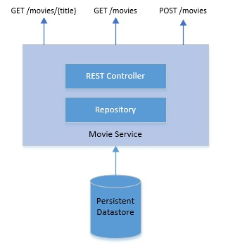

## Metodologia Twelve-Factor em um microsserviço SpringBoot

### Material de preparação
[Twelve-Factor Methodology in a Spring Boot Microservice](https://www.baeldung.com/spring-boot-12-factor)<br/>

### Introdução
Neste tutorial, entenderemos a metodologia [The Twelve-Factor](https://12factor.net/), também conhecida como **12 fatores**.<br/>
No processo, veremos como aplicar a metodologia **The Twelve-Factor** para o desenvolvimento de um microsserviço.

### O que é a metodologia The Twelve-Factor?
A metodologia **The Twelve-Factor** é um conjunto de doze práticas recomendadas para desenvolver aplicativos desenvolvidos para execução como serviço. 
Isso foi originalmente elaborado pela Heroku para aplicativos implantados como serviços em sua plataforma em nuvem, em 2011. 
Com o tempo, isso provou ser genérico o suficiente para qualquer desenvolvimento de [software como serviço (SaaS)](https://en.wikipedia.org/wiki/Software_as_a_service).

Então, o que queremos dizer com software como serviço? Tradicionalmente, projetamos, desenvolvemos, implantamos e mantemos soluções de software para derivar o valor comercial. 
Mas não precisamos nos envolver nesse processo para alcançar necessariamente o mesmo resultado. Por exemplo, calcular o imposto aplicável é uma função genérica 
em muitos domínios.

Agora, podemos decidir construir e gerenciar esse serviço por conta própria ou assinar uma oferta de serviço comercial. Essas ofertas de serviço são o que conhecemos como 
software como serviço.<br/>
Embora o software como serviço não imponha nenhuma restrição à arquitetura em que foi desenvolvido, é bastante útil adotar algumas práticas recomendadas.<br/>
Se projetamos nosso software para ser modular, portátil e escalável em modernas plataformas em nuvem, é bastante favorável às nossas ofertas de serviços. 
É aqui que a metodologia de doze fatores ajuda. Vamos vê-los em ação posteriormente no tutorial.

### Microsserviço com Spring Boot
O microsserviço é um estilo arquitetônico para desenvolver software como serviços vagamente acoplados. O principal requisito aqui é que os **serviços sejam organizados em 
torno dos limites do domínio comercial**. Geralmente, essa é a parte mais difícil de identificar.

Além disso, um serviço aqui tem autoridade exclusiva sobre seus dados e expõe operações a outros serviços. A comunicação entre serviços geralmente é feita através de 
protocolos leves como HTTP. Isso resulta em serviços implementáveis ​​e escaláveis ​​independentemente.

Agora, a arquitetura de microsserviço e o software como serviço não dependem um do outro. Mas não é difícil entender que, ao desenvolver software como serviço, aproveitar a 
arquitetura de microsserviço é bastante benéfico . Ajuda a alcançar muitos objetivos que discutimos anteriormente, como modularidade e escalabilidade.


O Spring Boot é uma estrutura de aplicativos baseada no Spring, que tira muitos clichês associados ao desenvolvimento de um aplicativo corporativo. Ele nos fornece uma 
plataforma altamente opinativa, mas flexível, para desenvolver microsserviços. Neste tutorial, aproveitaremos o Spring Boot para fornecer um microsserviço usando a 
metodologia de doze fatores.

### Aplicando a metodologia The Twelve-Factor
Vamos agora definir um aplicativo simples que tentaremos desenvolver com as ferramentas e práticas que acabamos de discutir. Todos nós gostamos de assistir filmes, mas é um 
desafio acompanhar os filmes que já assistimos.<br/>
Agora, quem gostaria de começar um filme e depois abandoná-lo mais tarde? O que precisamos é de um serviço simples para gravar e consultar filmes que assistimos:<br/>


Este é um microsserviço simples e padrão com um armazenamento de dados e um Endpoint REST. Precisamos definir um modelo que também será mapeado para persistência:
```java
@Entity
public class Movie {
    @Id
    private Long id;
    private String title;
    private String year;
    private String rating;
    // getters and setters
}
```
Definimos uma entidade JPA com um ID e alguns outros atributos. Vamos agora ver como é o controller REST:
```java
@RestController
public class MovieController {
  
    @Autowired
    private MovieRepository movieRepository;
    @GetMapping("/movies")
    public List<Movie> retrieveAllStudents() {
        return movieRepository.findAll();
    }
 
    @GetMapping("/movies/{id}")
    public Movie retrieveStudent(@PathVariable Long id) {
        return movieRepository.findById(id).get();
    }
 
    @PostMapping("/movies")
    public Long createStudent(@RequestBody Movie movie) {
        return movieRepository.save(movie).getId();
    }
}
```
Isso cobre a base do nosso serviço simples. Examinaremos o restante do aplicativo enquanto discutimos como implementamos a metodologia de doze fatores nas subseções a seguir.<br/>
O código completo da aplicação que utilizaremos de exempo neste laboratório pode ser encontrado no seguinte [link](./exemplo/spring-boot-12-factor).

### 1º Fator - Base de Código(Codebase)
A primeira prática recomendada de aplicativos de doze fatores é rastreá-lo em um sistema de controle de versão. O Git é o sistema de controle de versão mais popular atualmente 
em uso e é quase onipresente.<br/>
O princípio afirma que **um aplicativo deve ser rastreado em um único repositório de código e não deve compartilhar esse repositório com outros aplicativos**.<br/>
O Spring Boot oferece muitas maneiras convenientes de inicializar um aplicativo, incluindo uma ferramenta de linha de comando e uma interface da web. Já possuirmos nosso 
microsserviço pronto podemos convertê-lo em um repositório git:
```java
git init
```
Este comando deve ser executado a partir da raiz do aplicativo. O aplicativo neste estágio já contém um arquivo .gitignore que efetivamente impede que os arquivos gerados sejam 
controlados por versão. Portanto, podemos criar imediatamente um commit inicial:
```java
git add .
git commit -m "Adding the bootstrap of the application."
```
Por fim, podemos adicionar nosso git remote e enviar nossos commits para o nosso repositório se desejarmos (este não é um requisito estrito):
```java
git remote add origin https://github.com/<username>/12-factor-app.git
git push -u origin master
```

### 2º Fator - Dependências
Em seguida, **o aplicativo de doze fatores sempre deve declarar explicitamente todas as suas dependências**. Deveríamos fazer isso usando um manifesto de declaração de 
dependência. O Java possui várias ferramentas de gerenciamento de dependências, como Maven e Gradle. Podemos usar um deles para atingir esse objetivo.<br/>
Portanto, nosso aplicativo simples depende de algumas bibliotecas externas, como uma biblioteca para facilitar as APIs REST e conectar-se a um banco de dados. 
Utilizaremos o Maven em nossas explicações, o Maven exige que descrevamos as dependências de um projeto em um arquivo XML, normalmente conhecido como 
[POM(Project Object Model)](https://maven.apache.org/guides/introduction/introduction-to-the-pom.html).<br/>
Podemos definir nossas dependências declarativamente da seguinte forma:
```xml
	<dependencies>
		<dependency>
			<groupId>org.springframework.boot</groupId>
			<artifactId>spring-boot-starter-web</artifactId>
		</dependency>

		<dependency>
			<groupId>org.springframework.boot</groupId>
			<artifactId>spring-boot-starter-data-jpa</artifactId>
		</dependency>
		<dependency>
			<groupId>org.springframework.boot</groupId>
			<artifactId>spring-boot-starter-data-rest</artifactId>
		</dependency>

		<dependency>
			<groupId>com.h2database</groupId>
			<artifactId>h2</artifactId>
			<scope>runtime</scope>
		</dependency>
		<dependency>
			<groupId>org.springframework.boot</groupId>
			<artifactId>spring-boot-starter-test</artifactId>
			<scope>test</scope>
		</dependency>

		<!-- Início Dependências para compatibilidade com o Java 11 -->
		<dependency>
			<groupId>javax.xml.bind</groupId>
			<artifactId>jaxb-api</artifactId>
			<version>2.2.11</version>
		</dependency>
		<dependency>
			<groupId>com.sun.xml.bind</groupId>
			<artifactId>jaxb-core</artifactId>
			<version>2.2.11</version>
		</dependency>
		<dependency>
			<groupId>com.sun.xml.bind</groupId>
			<artifactId>jaxb-impl</artifactId>
			<version>2.2.11</version>
		</dependency>
		<dependency>
			<groupId>javax.activation</groupId>
			<artifactId>activation</artifactId>
			<version>1.1.1</version>
		</dependency>
		<dependency>
			<groupId>org.javassist</groupId>
			<artifactId>javassist</artifactId>
			<version>3.23.1-GA</version>
		</dependency>
		<!-- Fim Dependências para compatibilidade com o Java 11 -->

	</dependencies>
```
Embora isso pareça claro e simples, essas dependências geralmente têm outras dependências transitivas. Isso complica até certo ponto, mas nos ajuda a alcançar nosso objetivo. 
Agora, nosso aplicativo não tem uma dependência direta que não é explicitamente descrita.

### 3º Fator - Configurações
Um aplicativo geralmente possui muitas configurações, algumas das quais podem variar entre implantações, enquanto outras permanecem as mesmas.<br/>
No nosso exemplo, temos um banco de dados persistente em memória. Precisamos do endereço e das credenciais do banco de dados para se conectar. É mais provável que isso mude 
entre implantações.<br/> 
**Um aplicativo de doze fatores deve externalizar todas essas configurações que variam entre implantações**. A recomendação aqui é usar variáveis ​​de ambiente para essas 
configurações. Isso leva a uma separação limpa de configuração e código.
O Spring fornece um arquivo de configuração onde podemos declarar essas configurações e anexá-las às variáveis ​​de ambiente:
```java
spring.datasource.url=jdbc:h2:mem:${H2_DB_NAME}
spring.datasource.driverClassName=org.h2.Driver
spring.datasource.username=${H2_USERNAME}
spring.datasource.password=${H2_PASSWORD}

spring.jpa.database-platform=org.hibernate.dialect.H2Dialect
```
Aqui definimos o nome e as credenciais de nossa base de dados H2.<br/>
No Windows, podemos definir a variável de ambiente antes de iniciar o aplicativo:
```java
set H2_DB_NAME=testdb
set H2_USERNAME=username
set H2_PASSWORD=password
```
Podemos usar uma ferramenta de gerenciamento de configuração como [Ansible](https://www.ansible.com/) ou [Chef](https://www.chef.io/) para automatizar esse processo.

### 4º Fator - Backing Services
Backing Services são serviços dos quais o aplicativo depende para operação. Por exemplo, um banco de dados ou um intermediário de mensagens. **Um aplicativo de doze 
fatores deve tratar todos os serviços de apoio como recursos anexados.** O que isso significa efetivamente é que não deve exigir nenhuma alteração no código para trocar 
um serviço de suporte compatível. A única alteração deve estar nas configurações. <br/>
Em nosso aplicativo, usamos o H2 como Backing Services para fornecer persistência em memória.<br/>
O Spring JPA torna o código bastante independente do provedor de banco de dados real. Só precisamos definir um repositório que forneça todas as operações padrão:
```java
@Repository
public interface MovieRepository extends JpaRepository<Movie, Long> {
}
```
Como podemos ver, isso não depende diretamente do H2. O Spring detecta o driver H2 no caminho de classe e fornece uma implementação específica dessa interface 
dinamicamente ao H2. Além disso, ele extrai outros detalhes diretamente das configurações.<br/>
Portanto, se precisarmos mudar do H2 para o Oracle, basta substituir o driver em nossas dependências e substituir as configurações.

### 5º Fator - Build, Release and Run
A metodologia de doze fatores **separa estritamente o processo de conversão da base de código em um aplicativo em execução** em três estágios distintos:
 * **Fase de Build**: É aqui que pegamos a base de código, executamos verificações estáticas e dinâmicas e geramos um pacote executável como um JAR. Usando uma ferramenta como 
 o Maven isso é bastante trivial:
 ```java
 mvn clean compile package
 ``` 
 
 * **Fase de Release**: é o estágio em que pegamos o pacote executável e o combinamos com as configurações corretas. Aqui podemos criar uma imagem docker de nossa aplicação com 
 o seguinte Dockerfile:
```java
FROM openjdk:11

# Configurando Timezone para America/Sao_Paulo
RUN cp /usr/share/zoneinfo/America/Sao_Paulo /etc/localtime
RUN dpkg-reconfigure --frontend noninteractive tzdata

# Setando diretorio raiz
WORKDIR /home/binarios

# Copiando binario que sera utilizado para execucao no container
COPY ./target/12factor-0.0.1.jar /home/binarios/12factor-0.0.1.jar

# Comando a ser executado durante a inicializacao da aplicacao
CMD ["sh", "-c", "java -jar ./12factor-0.0.1.jar"]
```
Para gerar nossa imagem através deste Dockerfile podemos utilizar o seguinte comando:
```java
docker build -f Dockerfile -t 12factor:v0.0.1 .
```
Com o código acima geramos uma imagem Docker chamada **12factor:v0.0.1** 
 * Fase Run: Finalmente, este é o estágio em que executamos o aplicativo. Se usarmos o Docker como o contêiner para liberar nosso aplicativo, a execução do aplicativo poderá 
 ser bastante simples:
```java
docker run --name teste -p 8080:8080 --env-file .env -it 12factor:v0.0.1
```
No código acima utilizamos a imagem **12factor:v0.0.1** que geramos na Fase de Release e criamos um container chamado teste, mapeamos a porta 8080 para acessar o container e 
utilizamos um arquivo .env com as variáveis de ambiente que deverão ser carregadas na criação de nosso container.<br/>
O conteúdo de nosso arquivo .env é o seguinte:
```java
H2_DB_NAME=testdb
H2_USERNAME=username
H2_PASSWORD=password
```

Finalmente, não precisamos necessariamente executar esses estágios manualmente. É aqui que [Jenkins](https://jenkins.io/) é bastante útil com seu pipeline declarativo.

### 5º Fator - Processos 
