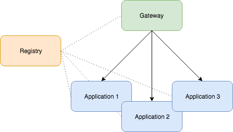
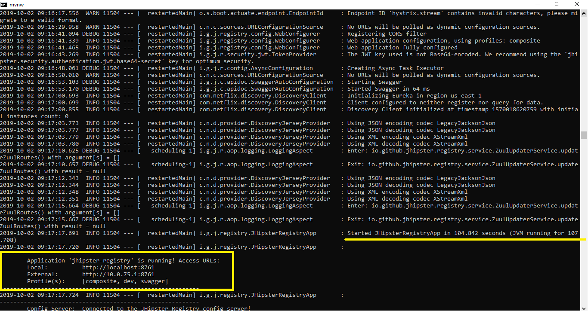
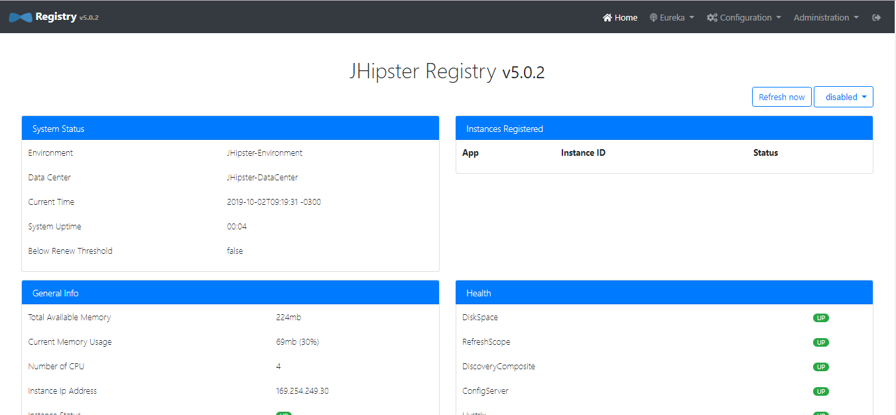
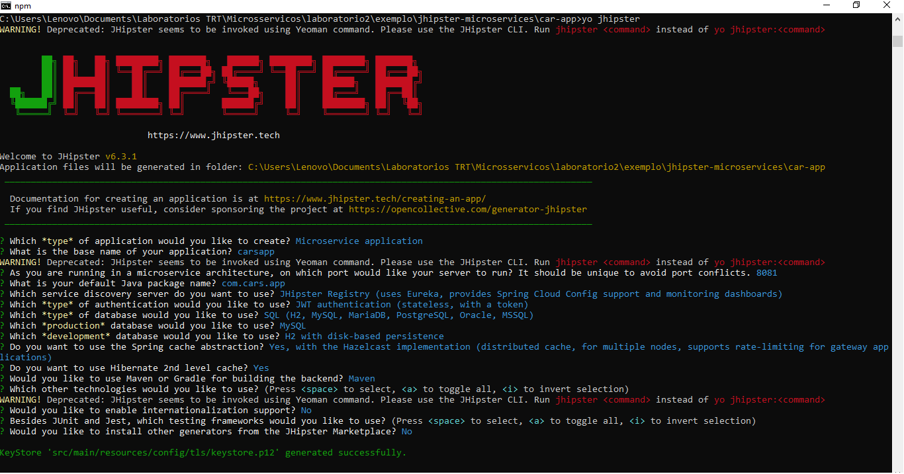
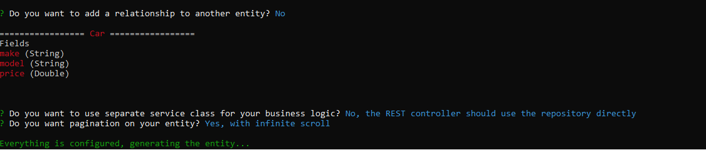
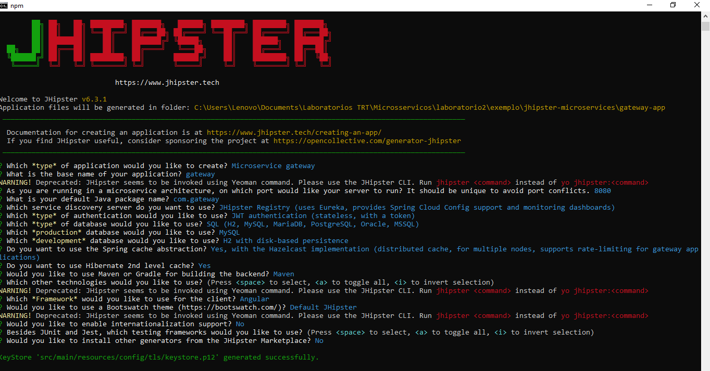
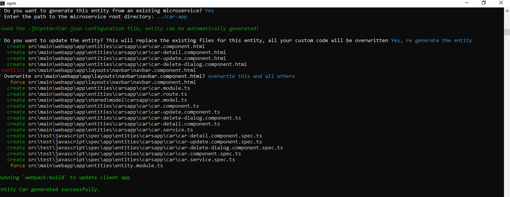
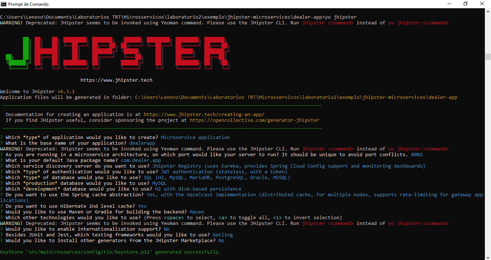
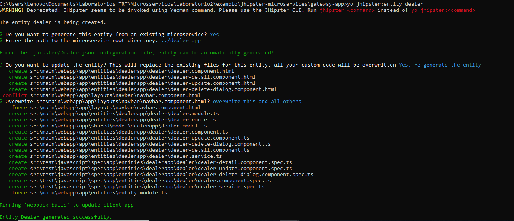
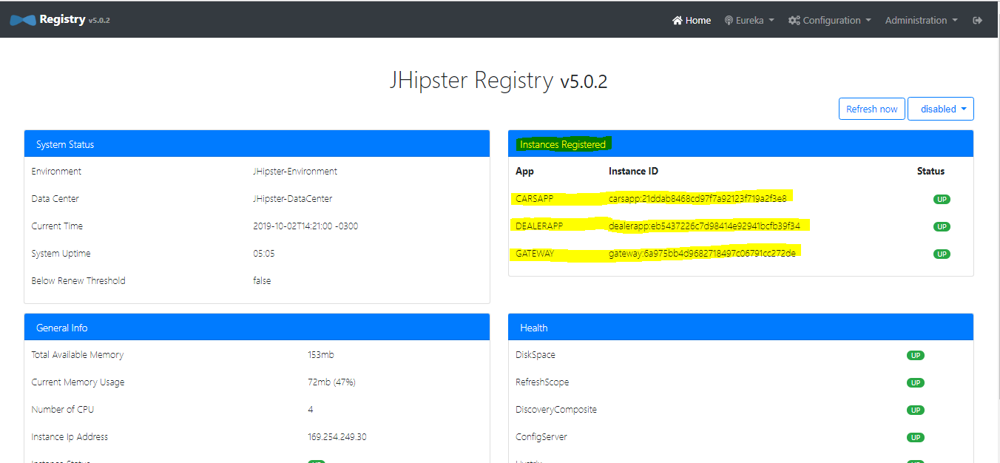

## JHipster com a arquitetura de microsserviços

### Material de preparação

[JHipster with a Microservice Architecture](https://www.baeldung.com/jhipster-microservices)<br/>

### Introdução

Neste artigo, exploraremos um exemplo interessante com o [JHipster](https://jhipster.github.io/) - construindo uma arquitetura simples de microsserviços. Mostraremos como criar
e implantar todas as peças necessárias e, no final, teremos um aplicativo de microsserviço completo em funcionamento.<br/>

### Componentes de microsserviços JHipster

Ao trabalhar em uma arquitetura de microsserviços com o JHipster, precisaremos criar e implantar pelo menos três projetos diferentes: um **JHipster Registry**, um **Microservice
Gateway** e pelo menos um Microservice Application.<br/>

- O **JHipster Registry** é uma parte essencial da arquitetura de microsserviço. Ele une todos os outros componentes e permite que eles se comuniquem.
- O **Microservice Application** contém o código de back-end. Depois de executada, ela irá expor a API para o domínio em questão. Uma arquitetura de microsserviço pode ser
  composta de muitos aplicativos de microsserviço, cada um contendo algumas entidades e regras de negócios relacionadas.
- O **Microservice Gateway** possui todo o código front-end (Angular) e consumirá a API criada por todo o grupo de aplicativos de microsserviço:



### Instalação do JHipster
O JHipster pode ser instalado através do [NodeJS](https://nodejs.org/en/) que nada mais é do que um gerenciador de pacotes.<br/>
Para podermos fazer isso primeiro precisaremos instalar o NodeJS.<br/>
Caso esteja utilizando Windows siga os passos deste [artigo](https://www.guru99.com/download-install-node-js.html) para instalar o NodeJS, caso esteja utilizando Linux siga 
os passos deste [artigo](https://tecadmin.net/install-latest-nodejs-npm-on-ubuntu/) para instalar o NodeJS.

Após concluir a instalação do NodeJS em sua máquina abra um prompt de comando e execute o seguinte comando para instalação do JHipster:
```java
npm install -g generator-jhipster
```
Após isso já possuiremos o CLI do JHipster instalado e pronto para uso.


### Criando um projeto de microsserviço

Agora vamos instalar os três componentes principais do nosso projeto de microsserviço.<br/>
Como o **JHipster Registry** é um padrão JHipster, precisamos apenas fazer o download e executá-lo. Não há necessidade de modificá-lo:

```java
mkdir jhipster-microservices && cd jhipster-microservices
git clone https://github.com/jhipster/jhipster-registry
cd jhipster-registry && ./mvnw
```

Isso criará o diretório **jhipster-microservices**(que servirá como diretório raiz para criamos nossos projetos), clonará o projeto **jhipster-registry** do GitHub e iniciará o aplicativo.<br/>
Quando a aplicação estiver em execução você verá algo semelhante a isso:<br/>


Uma vez iniciado com êxito, podemos visitar http://localhost:8761/ e efetuar login com o usuário
**admin** e a senha **admin**, e veremos algo semelhante a isso:<br/>


### Instalando um Microservice Application

Aqui é onde começamos a construir os recursos reais do nosso projeto. Neste exemplo, criaremos um **Microservice Application** simples que gerencia carros. Então, primeiro
criaremos o aplicativo e, em seguida, adicionaremos uma entidade a ele.<br/>
Abra um novo prompt de comando, navegue até nosso diretório **jhipster-microservices** e execute os seguintes comandos:

```java
mkdir car-app && cd car-app
jhipster
```

Depois que o assistente for iniciado, siga as instruções para criar um aplicativo do tipo Microservice chamado **carsapp**. Alguns outros parâmetros relevantes são:

- **port**: 8081
- **package**: com.car.app
- **authentication**: JWT
- **service discovery**: JHipster Registry

A captura de tela abaixo mostra o conjunto completo de opções:<br/>


Após a criação de nosso projeto vamos adicionar uma entidade car ao nosso aplicativo:

```java
jhipster:entity car
```

O assistente de criação da entidade será iniciado. Devemos seguir as instruções para criar uma entidade chamada **car** com três campos: **make** e **model** do tipo String, e **price** do tipo Double.<br/>
Após criar essas 3 campos preencha as perguntas subsequentes da seguinte forma:<br/>


Quando terminar, nosso primeiro **Microservice Application** estará concluído. Se dermos uma olhada no código gerado, perceberemos que não há javascript, HTML, CSS ou qualquer
código de front-end. Todos serão produzidos depois que o **Microservice Gateway** for criado. Além disso, consulte o arquivo LEIA-ME para obter informações importantes sobre o
projeto e comandos úteis.<br/>
Para finalizar, vamos executar nosso componente recém-criado:

```java
mvnw
```

Antes de executar o comando acima, devemos garantir que o componente **jhipster-registry** esteja em funcionamento. Caso contrário, obteremos um erro.<br/>
Se tudo corresse conforme o planejado, nosso aplicativo para carros seria iniciado e o **jhipster-register** nos informará que o aplicativo foi registrado com sucesso:

```java
Registered instance CARSAPP/carsapp:746e7525dffa737747dcdcee55ab43f8
  with status UP (replication=true)
```

### Instalando um Microservice Gateway

Agora, o front-end. Criaremos um **Microservice Gateway** e indicaremos a ele que temos uma entidade em um componente existente para o qual queremos criar o código front-end.<br/>
Abra um novo prompt de comando, navegue até nosso diretório **jhipster-microservices** e execute os seguintes comandos:

```java
mkdir gateway-app && cd gateway-app
jhipster
```

Vamos seguir as instruções para criar um aplicativo do tipo **Microservice Gateway**. Nomearemos o aplicativo como **gateway** e selecionaremos as seguintes opções para os outros parâmetros:

- **port**: 8080
- **package**: com.gateway
- **auth**: JWT
- **service discovery**: JHipster Registry

Aqui está um resumo do conjunto completo de parâmetros:<br/>


Vamos para a criação da entidade:

```java
jhipster:entity car
```

Serão realizadas algumas perguntas durante a geração da entidade, responda da seguinte forma e termos nossa entidade criada:<br/>


O JHipster encontrará o arquivo Car.json, que faz parte do **Microservice Application** existente que criamos anteriormente e usará os metadados contidos nesse arquivo para
criar todo o código de interface do usuário necessário para essa entidade:

```java
Found the .jhipster/Car.json configuration file, entity can be automatically generated!
```

Hora de executar o aplicativo de gateway e testar se tudo está funcionando:

```java
mvnw
```

Vamos agora navegar para http://localhost:8080/ e efetuar login com o usuário **admin** e a senha **admin**.<br/>
Clique no menu **Entities** e selecione a entidade **Car**, após isso crie um novo objeto Car utilizando o botão **Create a new Car**.<br/>


Exemplo de criação de um objeto Car:<br/>


### Criando o segundo Microservice Application

Em seguida, vamos dar um passo adiante ao nosso sistema e criar um segundo componente do tipo **Microservice Application**. Esse novo componente gerenciará revendedores de
automóveis, portanto, adicionaremos uma entidade chamada **dealer**.<br/>
Abra um novo prompt de comando, navegue até nosso diretório **jhipster-microservices** e execute os seguintes comandos:

```java
mkdir dealer-app && cd dealer-app
jhipster
```

Depois disso, digitamos **dealerapp** como o nome do aplicativo e escolhemos a **porta 8082** para que ela seja executada (é fundamental que seja uma porta diferente daquela
que estamos usando para o **jhipster-registry** e **car-app**).<br/>
Para os outros parâmetros, podemos escolher qualquer opção que desejar. Lembre-se de que este é um microsserviço separado.<br/>
Um exemplo completo de preenchimento seria:<br/>


Vamos adicionar alguns campos à nossa entidade **Dealer**. Por exemplo, **name** e **address** do tipo String:

```java
jhipster:entity dealer
```

Algumas perguntas serão feitas após gerar os 2 campos, você pode respoder da seguinte forma:<br/>


Não devemos esquecer de navegar para nossa aplicação **Microservice Gateway** e pedir para gerar o código de front-end para a entidade do revendedor, podemos fazer isso da seguinte forma:

```java
cd ../gateway-app
jhipster:entity dealer
```

Serão realizadas algumas perguntas durante a geração da entidade, responda da seguinte forma e termos nossa entidade criada:<br/>


Por fim, execute o seguinte comando para navegar até o projeto **dealer-app** e executar o projeto:

```java
cd ../dealer-app
mvnw
```

Em seguida, podemos visitar nosso aplicativo de gateway em http://localhost:8080 e atualizar a página para ver o item de menu recém-criado para a entidade **Dealer**.<br/>
Antes de concluirmos , vamos dar uma olhada no aplicativo **jhipster-registry** novamente em http://localhost:8761/. O esperado é que a tabela **Instances Registered** possua nossos 3 componentes registrados como no exemplo abaixo:
<br>

É isso! Criamos uma arquitetura sofisticada composta por um aplicativo Gateway com todo o código front-end suportado por dois microsserviços em apenas alguns minutos.

### Conclusão

Iniciar um projeto de arquitetura de microsserviço com o JHipster é bastante fácil, precisamos clonar e executar o projeto **JHipster Registry**, criar quantos **Microservice Applications** forem necessários e criar um **Microservice Gateway**, com isso
estamos prontos para começar.<br/>
Você pode explorar a estrutura ainda mais no site oficial do [JHipster](https://www.jhipster.tech/microservices-architecture/).<br/>
O código completo de nosso exemplo pode ser encontrado neste [link](./exemplo/jhipster-microservices/).
