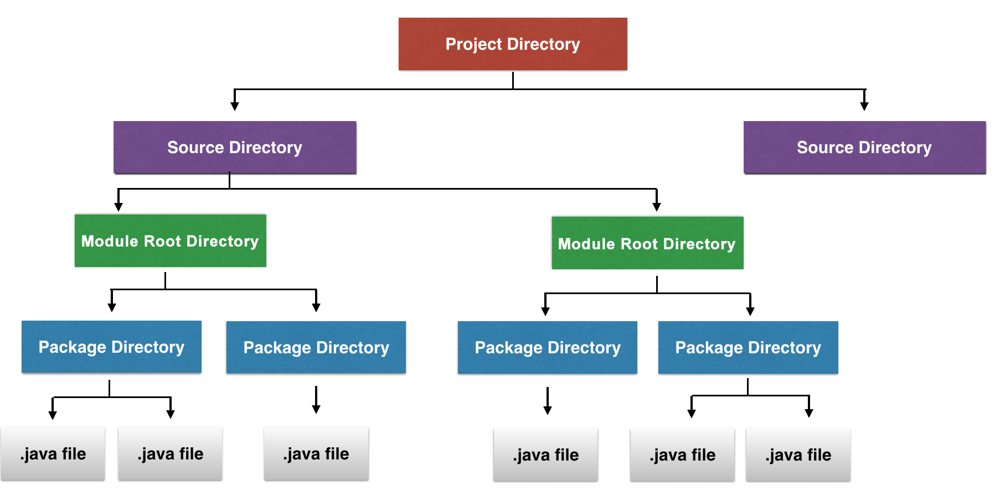
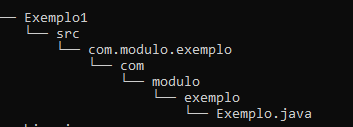
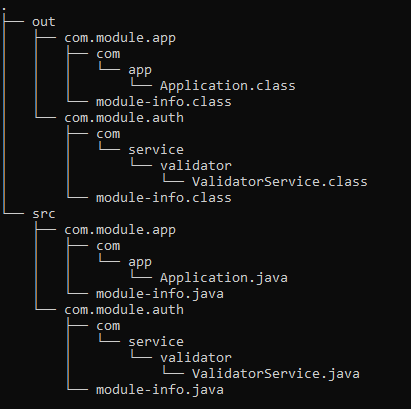

## Introdução aos Módulos do Java 9

### Material de preparação
[Introdução geral](https://blog.andresteingress.com/2017/09/29/java-9-modules.html)<br/>
[Guia geral para a Modularidade no Java 9](https://www.baeldung.com/java-9-modularity)

### Introdução
Os módulos podem ser vistos como um novo componentes do Java, responsável por proporcionar um forte nível de encapsulamento em nossos componentes Java.<br/>
Atualmente possuímos modificadores de acesso que restringem o acesso a certas classes que criamos, porém mesmo com esses modificadores ainda é possível burlar essas 
restrições e realizar acesso a componentes que inicialmente não deveriamos poder acessar.<br/>

Além de introduzir o conceito de módulos, o próprio Java 9 foi reestruturado em módulos de forma a manter a compatibilidade com o código anterior ao Java 9.<br/>

Os módulos no Java 9 são um assunto bem extenso, por isso abordaremos aqui apenas um exemplo de uso básico de comunicação entre módulos, caso queria se aprofundar em todas as 
possibilidades recomendamos fortemente ler o livro [Modular Programming in Java 9](https://www.oreilly.com/library/view/modular-programming-in/9781787126909/) escrito por Koushik Kothagal. 


### Estrutura de projetos
Com a introdução dos módulos a partir do Java 9 foi necessário realizar uma mudança na estrutura de projetos para estar de acordo com as convenções de uso de módulos.

Antes do Java 9, a estrutura de nossos projetos Java era bem semelhante a isso:<br/>
<br/>

Com o Java 9 a estrutura de nossos projetos Java ficará bem semelhante a isso:<br/>
<br/>
A grande mudança é que dentro de nosso diretório source iremos possuir um ou mais diretórios referentes aos nossos módulos, e dentro desses diretórios teremos toda a estrutura de 
pacotes do Java no qual já estamos todos bem familiarizados.

Um exemplo dessa estrutura com o Java 9 seria a seguinte:<br/>
<br/>
Analisando a estrutura de pastas:
 * Pasta Exemplo1 referente ao nome do projeto
 * Pasta **src** referente ao nosso diretório source
 * Pasta **com.modulo.exemplo** referente ao nosso módulo
 * As demais pastas dentro do diretório **com.modulo.exemplo** serão nossos pacotes

### Nomeando um módulo
As regras de nomenclatura do módulo são semelhantes a como nomeamos pacotes (pontos são permitidos, traços não são).<br/>
É muito comum fazer nomes de modulo no estilo Reverse-DNS, como por exemplo com.module.example.


### O arquivo module-info.java
O arquivo **module-info.java** contém toda a nossa definição de um módulo, o mesmo deve ser armazenado no diretório raiz do módulo como no exemplo abaixo:<br/> 
<br/>

O arquivo **module-info.java** é declarado da seguinte forma onde **module.name** irá corresponder ao nome do módulo e o corpo do mesmo irá conter suas diretivas de acesso:
```java
module module.name {
    //Diretivas de acesso
}
```

Um módulo chamado com.module.example poderia ser declarado da seguinte forma:
```java
module com.module.example {
    //Diretivas de acesso
}
```

Uma declaração de módulo possui em seu corpo uma série de diretivas que nos permite infomar ao módulo o nível de permissão de acesso que seus pacotes possuem.<br/>
No material de preparação foi abordada cada uma dessas diretivas, nos próximos tópicos abordaremos as diretivas **requires** e **exports** que são as duas mais usadas.

#### Exercício 1
Considere a seguinte estrutura para esse exercício:<br/>


Com base no código contido deste [link](./exercicio/exercicio1/) 
crie o arquivo **module-info.java** no local correto.<br/>
O nome do módulo deve ser: **com.module.hello**


### Diretiva requires
A diretiva **requires** nos permite declarar que um módulo depende de outro para seu funcionamento, as dependências importadas com requires funcionam em tempo de execução 
e em tempo de compilação.<br/>
No exemplo abaixo estamos declarando que o módulo **module.a** depende do **module.b** para funcionar:
```java
module module.a {
    requires module.b;
}
```

Existe uma pequena variação da diretiva **requires** que é a diretiva **requires static**.<br/>
O funcionamento da diretiva **requires static** é bem semelhante a diretiva **requires**, a diferença entre ele é que na diretiva **requires** temos dependências em tempo de 
execução e compilação, já a diretiva **requires static** nos fornece dependências apenas em tempo de compilação.<br/>
Exemplo:
```java
module module.a {
    requires module.b;
    requires static module.c;
}
```
No exemplo acima definimos que o **module.b** é uma dependência de execução e compilação, definimos também que o **module.c** é uma dependência apenas de tempo de compilação.

### Diretiva exports
Em resumo a diretiva **exports** diz ao nosso módulo quais pacotes do mesmo estão acessíveis para outros módulos externamente.<br/>
No exemplo abaixo estamos exportando o pacote fictício **com.service.valitador** para que o mesmo possa ser utilizado por módulos externos:
```java
module module.b {
    exports com.service.valitador;
}
```

### Comunicação entre módulos
Pense que um módulo é um jardim murado e por padrão qualquer tipo do Java em um módulo é acessível apenas para os tipos dentro do mesmo módulo.<br/>
Como os tipos de um módulo não são acessíveis por padrão para os módulos externos precisamos realizar um processo de exportação de dependências e importação das mesmas 
para que um ou mais módulos se comuniquem entre si.<br/>
Considere a seguinte estrutura para nosso projeto de exemplo:<br/>


Precisamos que o módulo **com.module.app** acesse o pacote **com.service.validator** do módulo **com.module.auth**, para fazer isso duas condições precisam ser satisfeitas:
 * O módulo **com.module.app** precisa declarar que é dependente no módulo **com.module.auth**, processo realizado utilizando a diretiva **requires**
 * O módulo **com.module.auth** precisa declarar que o pacote **com.service.validator** pode ser acessado externamente por outros módulos, processo realizado utilizando a diretiva **exports**

Para realizar a comunicação entre eles podemos configurar seus módulos da seguinte forma:
```java
// Arquivo ./src/com.module.app/module-info.java
module com.module.app {
    requires com.module.auth;
}
```
```java
// Arquivo ./src/com.module.auth/module-info.java
module com.module.auth {
    exports com.service.validator;
}
```

Para usar um pacote de outro módulo em uma classe basta realizar o import normalmente como no exemplo abaixo:<br/>
```java
import com.service.validator.ValidatorService;

public class Application {

    public static void main(String[] args){
        // Implementação de uso
    }

}
```

Você pode ver o código completo desse exemplo neste [link](./exemplos/exemplo03/).


#### Exercício 2
Considere a seguinte estrutura para esse exercício:<br/>


Com base no código contido deste [link](./exercicio/exercicio2/) faça com que o módulo **com.module.login** possa ser acessado pelo módulo **com.module.app** de forma que o 
módulo **com.module.login** disponibilize o pacote **com.validator.login** para acesso externo em outros módulos.<br/>


### Realizando o build dos módulos via linha de comando
Para realizar o build de módulos podemos utilizar o seguinte comando:
```java
javac -d PASTA_DESTINO_MODULOS_COMPILADOS --module-source-path PASTA_SOURCE_DOS_MODULOS --module PRIMEIRO_MODULO,SEGUNDO_MODULO,...
```
Explicação dos parâmetros:
 * **-d**: Indica a pasta de destino no qual os módulos compilados serão armazenados
 * **--module-source-path**: Indica a pasta source onde os módulos a serem compilados estão armazenados
 * **--module**: Indica o nome dos módulos a serem compilados, este parâmetro aceita um ou mais argumentos contanto que sejam separados por vírgula. 

Conside o código de exemplo do tópico [Comunicação entre módulos](#comunicação-entre-módulos), o mesmo possui a seguinte estrutura:<br/>
<br/>

E seu código está disponível neste [link](./exemplos/exemplo03/).

Para realizarmos a compilação desses módulos poderíamos exercutar o comando dessa forma:
```java
javac -d out --module-source-path src --module com.module.app,com.module.auth
```
Neste exemplo de compilação a pasta **out** seria a pasta destino onde os módulos compilados seriam armazenados, a pasta **src** seria nossa pasta source onde os módulos a serem 
compilados estão armazenados, e os módulos a serem compilados são **com.module.app** e **com.module.auth**.

O resultado de execução deste comando será semelhante a este gerando assim nossos módulos compilados:<br/>
<br/>

#### Exercício 3
Considere a seguinte estrutura para esse exercício:<br/>


Com base no código contido neste [link](./exercicio/exercicio3/), compile os módulos **com.module.app** e **com.module.auth** conforme explicado no tópico anterior.

### Usando módulos via linha de comando
Após ter os módulos compilados podemos utilizá-los através do seguinte comando:
```java
java --module-path PASTA_MODULOS_COMPILADOS -m nome.modulo/caminho.pacote.NomeClasseMetodoMain
```
Explicação dos parâmetros:
 * **--module-path**: Indica em qual pasta a JVM deve buscar os módulos compilados para uso.
 * **-m**: Indica o nome do módulo, e o nome totalmente qualificado da classe que possui o método main para execução.

Conside o código de exemplo do tópico [Comunicação entre módulos](#comunicação-entre-módulos), o mesmo possui a seguinte estrutura após ser compilado:<br/>
<br/>

E seu código compilado está disponível neste [link](./exemplos/exemplo03_compilado/).

Para executarmos esse código compilado iremos precisar identificar qual dos módulos possui uma classe **Main**, neste código de exemplo o módulo **com.module.app** possui a classe 
**Application** que possui um método **Main** declarado, com a classe **Main** identificada podemos executar o comando da seguinte forma:<br/>
```java
java --module-path out -m com.module.app/com.app.Application
```
Neste exemplo especificamos a pasta **out** como sendo a pasta que contém os módulos compilados, no parâmetro **-m** especificamos que o módulo que possui a classe **Main** 
é o módulo **com.module.app**, espeficamos também o nome totalmente qualificado da classe **Main** composto pelo nome de seu pacote e o nome da classe **Main**.

#### Exercício 4
Considere a seguinte estrutura para esse exercício:<br/>


Com base no código compilado contido neste [link](./exercicio/exercicio4/) execute o módulo compilado via linha de comando conforme explicado no tópico anterior.
