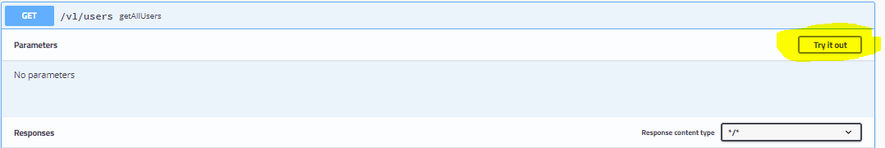
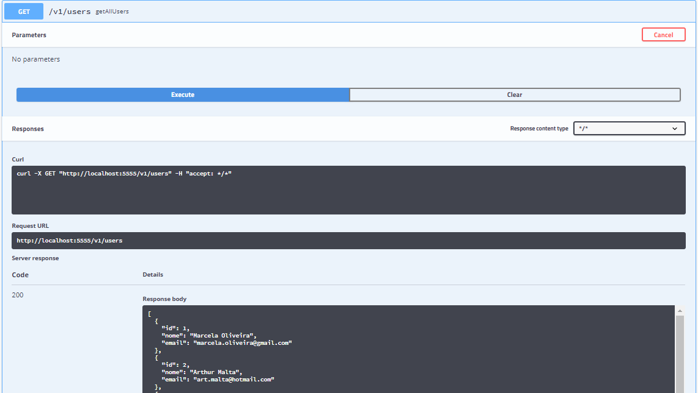

## Introdução a OpenAPI

### Material de preparação
[Introdução conceitual OpenAPI e Swagger](https://swagger.io/docs/specification/about/)<br/>
[Documentando uma Api com Swagger e SpringBoot](https://www.treinaweb.com.br/blog/documentando-uma-api-spring-boot-com-o-swagger/)<br/>

### Introdução
OpenApi é uma especificação para descrição de API para APIs REST. Um arquivo OpenAPI permite que você descreva toda a sua API, incluindo:
 * Endpoints disponíveis (/users) e operações em cada Endpoint ( GET /users, POST /users)
 * Parâmetros de operação Entrada e saída para cada operação
 * Métodos de autenticação
 * Informações de contato, licença, termos de uso e outras informações
 
As especificações da API podem ser escritas em YAML ou JSON. O formato é fácil de aprender e legível para humanos e máquinas.


O Swagger é um conjunto de ferramentas de código aberto criadas em torno da Especificação OpenAPI que podem ajudá-lo a projetar, criar, documentar e consumir APIs REST.<br/>
Neste laboratório iremos utilizar a implementação Springfox do Swagger e daremos uma pequena introdução sobre sua configuração e uso.<br/>
Caso queira se aprofundar nessa API recomendamos que leia a documentação da mesma que pode ser encontrada neste [link](https://springfox.github.io/springfox/docs/current/).


### Projeto base para este laboratório
Neste laboratório iremos implementar o Swagger em uma API de usuários, o código da mesma está disponível neste [link](./exemplos/exemplo-sem-swagger)


### Adicionando o Springfox ao projeto
Para adicionar o Springfox ao projeto basta adicionar as seguintes dependências ao arquivo pom.xml do [projeto que iremos utilizar de exemplo](./exemplos/exemplo-sem-swagger):
```java
<dependency>
    <groupId>io.springfox</groupId>
    <artifactId>springfox-swagger2</artifactId>
    <version>2.9.2</version>
</dependency>

<dependency>
    <groupId>io.springfox</groupId>
    <artifactId>springfox-swagger-ui</artifactId>
    <version>2.9.2</version>
</dependency>
```

### Realizando a configuração básica do Swagger
Para configurar o Swagger precisamos criar uma classe de configuração com um Bean do tipo Docket, com apenas isso o Swagger se encarregará de criar uma documentação padrão 
para nossa API mapeando todos os Endpoints e Paths aceitos durante a configuração.<br/>
Um exemplo básico dessa configuração seria:
```java
import org.springframework.context.annotation.Bean;
import org.springframework.context.annotation.Configuration;
import springfox.documentation.builders.PathSelectors;
import springfox.documentation.builders.RequestHandlerSelectors;
import springfox.documentation.spi.DocumentationType;
import springfox.documentation.spring.web.plugins.Docket;
import springfox.documentation.swagger2.annotations.EnableSwagger2;


@Configuration
@EnableSwagger2
public class SwaggerConfig {

    @Bean
    public Docket configuracaoBasica() {
        return new Docket(DocumentationType.SWAGGER_2)
                .select()
                .apis(RequestHandlerSelectors.basePackage("com.exemplo"))
                .paths(PathSelectors.any())
                .build();
    }
}
```

O Bean Docket inicializa o Bean principal do Springfox para configurar a especificação Swagger 2.<br/>
A annotation @EnableSwagger2 é responsável por ativar o Springfox em nossa aplicação.<br/>
Veja que criamos um Bean do tipo **Docket** especificando através da propriedade **DocumentationType.SWAGGER_2** que a documentação a ser criada é do tipo Swagger 2, além disso 
possuímos os métodos: 
 * **select()**: Retorna uma instância do ApiSelectBuilder para fornecer controle sobre os Endpoints expostos por meio de swagger.
 * **apis()**: Define quais classes serão incluídas, você pode limitá-las por um pacote base, classe ou método, neste exemplo limitamos apenas ao pacote **com.exemplo**.
 * **paths()**: Você pode definir quais métodos do Endpoint devem ser incluídos na documentação, neste exemplo incluímos todos.
 * **build()**: Retorna um objeto do tipo Docket inicializado com as propriedades que definimos durante sua construção.
 
Com apenas isso nossa aplicação já possuirá uma documentação padrão criada pelo Swagger, você pode acessá-la pelo seu navegar através da seguinte url: http://localhost:porta/swagger-ui.html, 
especificando a porta no qual sua aplicação SpringBoot está sendo executada. 

Ao fazer isso você verá algo semelhante a isso:<br/>


O Swagger documentou todos os Endpoints do pacote "com.exemplo", assim como todos os seus métodos e retorno.<br/>
Também é possível testar os métodos mapeados, observe o exemplo abaixo:<br/>

Através do botão **Try it out** podemos testar a requisição GET para o a URI **/v1/users/**, ao executar o teste poderemos ver um retorno semelhante a este:<br/>



### Personalizando o que foi criado pelo Swagger
A documentação criada para nossa API foi feita utilizando o formato de documentação padrão do Swagger, também podemos personalizar algns pontos dessa documentação.<br/>
Observe este exemplo de configuração personalizada do Swagger:<br/>
```java
@Configuration
@EnableSwagger2
public class SwaggerConfig {

    @Bean
    public Docket configuracaoPersonalizada() {
        return new Docket(DocumentationType.SWAGGER_2)
                .select()
                .apis(RequestHandlerSelectors.basePackage("com.exemplo"))
                .paths(PathSelectors.any())
                .build()
                .apiInfo(apiInfo());
    }

    private ApiInfo apiInfo() {
        ApiInfo apiInfo = new ApiInfoBuilder()
                .title("My REST API")
                .description("Api de usuários")
                .version("v1")
                .termsOfServiceUrl("Terms of service")
                .contact(new Contact("Nome do Contato", "www.example.com", "myeaddress@company.com"))
                .license("License of API")
                .licenseUrl("API license URL")
                .build();

        return apiInfo;
    }
}
```

Criamos um método chamado **apiInfo** que retorna um objeto do tipo **ApiInfo** e utilizamos este método na configuração de nosso Docket através do método apiInfo() de 
nosso Objeto Docket.<br/>
O resultado disso é uma descrição personalizada para nossa API com as configurações que definimos:


Podemos também adicionar uma descrição personalizada a nossos métodos, podemos realizar isso com a annotation @ApiOperation, a mesma deve ser adicionar em cima dos métodos do 
Endpoint que desejamos descrever.<br/>
Um exemplo de uso seria:
```java
import io.swagger.annotations.ApiOperation;
import org.springframework.beans.factory.annotation.Autowired;
import org.springframework.http.HttpStatus;
import org.springframework.http.ResponseEntity;
import org.springframework.web.bind.annotation.*;

import java.util.List;

@RestController
@RequestMapping("v1")
public class UsuarioEndpoint {

    @Autowired
    UsuarioService usuarioService;

    @GetMapping(path="users")
    @ApiOperation(value="Retorna uma lista com todos os usuários.", response = Usuario.class)
    public ResponseEntity<List<Usuario>> getAllUsers() {
        List<Usuario> allUsers = usuarioService.getAllUsers();
        return new ResponseEntity<>(allUsers, HttpStatus.OK);
    }

    @GetMapping(path="user/{id}")
    @ApiOperation(value="Retorna um usuário de acordo de acordo com o id informado.", response = Usuario.class)
    public ResponseEntity<Usuario> getUser(@PathVariable("id") int id) {
        Usuario user = usuarioService.getUserById(id);
        return new ResponseEntity<>(user, HttpStatus.OK);
    }


    @PostMapping(path="user")
    @ApiOperation(value="Cria um novo usuário.")
    public ResponseEntity<?> addUser(@RequestBody Usuario user) {
        usuarioService.addUser(user);
        return new ResponseEntity<>(HttpStatus.CREATED);
    }

    @PutMapping(path="user/{id}")
    @ApiOperation(value="Atualiza um usuário existente.")
    public ResponseEntity<?> updateUser (@PathVariable("id") int id, @RequestBody Usuario user) {
        usuarioService.updateUser(id, user);
        return new ResponseEntity<>(HttpStatus.OK);
    }

    @DeleteMapping(path="user/{id}")
    @ApiOperation(value="Deleta um usuário pelo ID")
    public ResponseEntity<?> deleteUser(@PathVariable("id") int id) {
        usuarioService.removeUser(id);
        return new ResponseEntity<>(HttpStatus.NO_CONTENT);
    }

}
```

O resultado desta configuração será semelhante a isso:<br/>


Podemos também personalizar a descrição de cada código de resposta dos métodos de nosso Endpoint, no exemplo abaixo estamos personalizando a descrição de alguns códigos de resposta 
de nosso método **getAllUsers()** com a annotation @ApiResponses que pode conter uma ou mais annotations @ApiResponse com o código de retorno e a descrição personalizada do mesmo.<br/>
```java
    @GetMapping(path="users")
    @ApiOperation(value="Retorna uma lista com todos os usuários.", response = Usuario.class)
    @ApiResponses(value = {
            @ApiResponse(code = 200, message = "Retorna a lista de Usuários"),
            @ApiResponse(code = 500, message = "Foi gerada uma exceção"),
    })
    public ResponseEntity<List<Usuario>> getAllUsers() {
        List<Usuario> allUsers = usuarioService.getAllUsers();
        return new ResponseEntity<>(allUsers, HttpStatus.OK);
    }
```

O resultado dessa personalização pode ser visto logo abaixo:


Como personalizamos apenas os códigos de retorno 200 e 500 os demais códigos de retorno continuam com a descrição padrão.

Existem uma série de annotations e configurações adicionais do que podem ser utilizadas personalizar a documentação criada pelo Swagger, abordamos apenas alguns exemplos 
dessas configurações.<br/>
Caso queira verificar todas as possibilidades recomendamos que consulte a [documentação do Springfox](https://springfox.github.io/springfox/docs/current/#configuring-springfox).<br/>