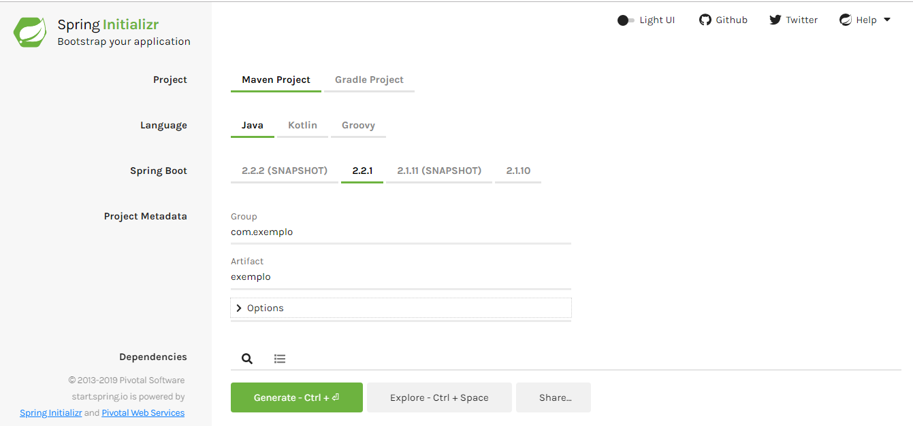

## Introdução ao JUnit 5


### Introdução

Desde que o JUnit 4 foi lançado, a mais de 10 anos atrás, muitas coisas mudaram.  Em especial, tivemos uma nova versão do Java com mudanças estruturais consideráveis, estamos falando do uso do lambda no JDK 8. Contudo, apesar disso, o core da biblioteca permaneceu o mesmo. 

Como consequência disso qualquer tentativa de mudança para acompanhar as novidades do Java por mais simples que fosse acabava quebrando todo o código interno já existente no JUnit.

Buscando superar estes e outros problemas foi criado o JUnit 5.

A partir desta versão é um requisito básico possuir o JDK-8.


### Dependências JUnit 5 para um projeto Maven comum

Até o JUnit 4 possuíamos uma dependência única que continha toda a estrutura do JUnit, a partir do JUnit 5 essa dependência única foi dividida em algumas partes sendo elas:

**JUnit Plataform**: contém elementos estruturais para execução de testes e define uma API para que outros *frameworks* possam ser executados pela plataforma do JUnit. 

**JUnit Jupiter**: dividido em duas dependências, sendo elas: 

* **JUnit Jupiter Api**: Esta dependência provisiona a API pública para escrever testes para o JUnit.
* **JUnit Jupiter Engine**: Esta dependência contém a implementação do mecanismo de teste JUnit Jupiter que executa nossos testes de unidade.

**JUnit Vintage**: Fornece suporte para execução de testes em um código que utilize versões 3 ou 4 do JUnit.

Para utilizar basta adicionar as seguintes dependências no projeto Maven:


```java
<!-- https://mvnrepository.com/artifact/org.junit.jupiter/junit-jupiter-api -->
<dependency>
    <groupId>org.junit.jupiter</groupId>
    <artifactId>junit-jupiter-api</artifactId>
    <version>5.5.2</version>
    <scope>test</scope>
</dependency>
		
<!-- https://mvnrepository.com/artifact/org.junit.jupiter/junit-jupiter-engine -->
<dependency>
    <groupId>org.junit.jupiter</groupId>
    <artifactId>junit-jupiter-engine</artifactId>
    <version>5.5.2</version>
    <scope>test</scope>
</dependency>

<!-- https://mvnrepository.com/artifact/org.junit.vintage/junit-vintage-engine -->
<dependency>
    <groupId>org.junit.vintage</groupId>
    <artifactId>junit-vintage-engine</artifactId>
    <version>5.5.2</version>
    <scope>test</scope>
</dependency>
```


Para utilizar o JUnit 5 em um projeto Maven precisamos também do plugin  **Maven Surefire Plugin** versão 2.22.1 ou superior.

```java
<build>
    <plugins>
        <plugin>
            <groupId>org.apache.maven.plugins</groupId>
            <artifactId>maven-surefire-plugin</artifactId>
            <version>2.22.1</version>
        </plugin>
    </plugins>
</build>
```


### JUnit 5 em um projeto SpringBoot

As versões mais recentes do SpringBoot 2 já possuem as dependências **junit-jupiter-api**, **junit-jupiter-engine** e **junit-vintage-engine** inclusas na dependência **spring-boot-starter-test**.

Com isso basta apenas importar a dependência **spring-boot-starter-test** para utilizar o JUnit no SpringBoot:

```java
<dependency>
	<groupId>org.springframework.boot</groupId>
	<artifactId>spring-boot-starter-test</artifactId>
	<scope>test</scope>
</dependency>
```


Para importar o JUnit sem o **JUnit Vintage Engine** poderíamos apenas excluí-lo ao importar a dependência como o exemplo abaixo:

```java
<dependency>
	<groupId>org.springframework.boot</groupId>
	<artifactId>spring-boot-starter-test</artifactId>
	<scope>test</scope>
	<exclusions>
		<exclusion>
		<groupId>org.junit.vintage</groupId>
		<artifactId>junit-vintage-engine</artifactId>
		</exclusion>
	</exclusions>
</dependency>
```


### Escrevendo um teste de unidade simples com SpringBoot e JUnit 5

Iremos acessar o site  [Spring Initializr](https://start.spring.io/) para criar uma projeto SpringBoot básico



Altere o valor do campo **Group** para **com.exemplo** e o valor do campo **Artifact** para **junit5**, após isso clique em **Generate** para baixar o projeto compactado.

Após isso extraia o projeto e o importe no Eclipse.

Alguns pontos que devemos saber antes de criar nosso primeiro teste de unidade:

* O diretório  **src/test/java**  contém o código fonte de nossos testes de unidade.
* O diretório **src/test/resources**  contém os [resources](http://makble.com/what-is-the-srcmainresources-folder-for-in-java-project) de nossa aplicação.


Crie uma classe chamada **TesteJUnitSpringBoot** no pacote **com.exemplo.junit5** com o seguinte conteúdo:

```java
package com.exemplo.junit5;

import org.junit.jupiter.api.Assertions;
import org.junit.jupiter.api.Test;
import org.springframework.boot.test.context.SpringBootTest;


@SpringBootTest
public class TesteJUnitSpringBoot {
	
	@Test
	public void validarEmail() {
		String regex = 
		        "^[_A-Za-z0-9-\\+]+(\\.[_A-Za-z0-9-]+)*@"
		        + "[A-Za-z0-9-]+(\\.[A-Za-z0-9]+)*(\\.[A-Za-z]{2,})$";
		
		String email = "teste123@teste.com.br";
		Assertions.assertTrue(email.matches(regex));
		
	}
	
}
```

### Erro comum
Algumas vezes quando estamos realizando testes no qual um de nossos objetos possui muitas dependências auto injetadas pelo Spring dentro de si com a 
anotação **@Autowired** ocorre de a instância do objeto não ser injetada pelo **@Autowired** e retornar como null ocasionando **NullPointerExceptions** durante a 
execução de nosso teste.

Para contornar este problemas podemos inserir a seguinte anotação no nível de classe

```java
// Outros imports

import org.springframework.test.context.junit.jupiter.SpringExtension;

@ExtendWith(SpringExtension.class)
//Declaração de classe e métodos

```
Estaremos dizendo ao SpringBoot para executar nossos testes utilizando a extensão **SpringExtension**.

Altere também a anotação **@SpringBootTest** para que ela receba a classe main de nossa aplicação como parâmetro como o exemplo abaixo:
```java
// Imports da aplicação

@SpringBootTest(classes = ApplicationMain.class)
//Declaração de classe e métodos

```

Com isso dizemos ao Spring que carregue o contexto de nossa classe main durante a execução de nosso teste.
