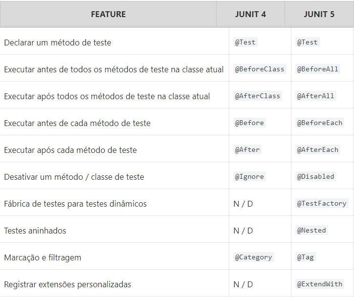

## JUnit 5


### Introdução

Desde que o JUnit 4 foi lançado, a mais de 10 anos atrás, muitas coisas mudaram.  Em especial, tivemos uma nova versão do Java com mudanças estruturais consideráveis, estamos falando do uso do lambda no JDK 8. Contudo, apesar disso, o core da biblioteca permaneceu o mesmo. 

Como consequência disso qualquer tentativa de mudança para acompanhar as novidades do Java por mais simples que fosse acabava quebrando todo o código interno já existente no JUnit.

Buscando superar estes e outros problemas foi criado o JUnit 5.

A partir desta versão é um requisito básico possuir o JDK-8.


### Dependências JUnit 5 para um projeto Maven comum

Até o JUnit 4 possuíamos uma dependência única que continha toda a estrutura do JUnit, a partir do JUnit 5 essa dependência única foi dividida em algumas partes sendo elas:

* **JUnit Jupiter Api**: Esta dependência provisiona a API pública para escrever testes para o JUnit.
* **JUnit Jupiter Engine **: Esta dependência contém a implementação do mecanismo de teste JUnit Jupter que executa nossos testes de unidade.
* **JUnit Vintage Engine**: Esta é uma dependência opcional que nos fornece suporte para execução de testes em um código que utilize versões 3 ou 4 do JUnit.


 	Para utilizar basta adicionar as seguintes dependências no projeto Maven:

```java
<!-- https://mvnrepository.com/artifact/org.junit.jupiter/junit-jupiter-api -->
<dependency>
    <groupId>org.junit.jupiter</groupId>
    <artifactId>junit-jupiter-api</artifactId>
    <version>5.5.2</version>
    <scope>test</scope>
</dependency>
		
<!-- https://mvnrepository.com/artifact/org.junit.jupiter/junit-jupiter-engine -->
<dependency>
    <groupId>org.junit.jupiter</groupId>
    <artifactId>junit-jupiter-engine</artifactId>
    <version>5.5.2</version>
    <scope>test</scope>
</dependency>

<!-- https://mvnrepository.com/artifact/org.junit.vintage/junit-vintage-engine -->
<dependency>
    <groupId>org.junit.vintage</groupId>
    <artifactId>junit-vintage-engine</artifactId>
    <version>5.5.2</version>
    <scope>test</scope>
</dependency>

```


Para utilizar o JUnit 5 em um projeto Maven precisamos também do plugin  **Maven Surefire Plugin** versão 2.22.0 ou superior.

```java
<build>
    <plugins>
        <plugin>
            <groupId>org.apache.maven.plugins</groupId>
            <artifactId>maven-surefire-plugin</artifactId>
            <version>2.22.1</version>
        </plugin>
    </plugins>
</build>
```


### JUnit 5 em um projeto SpringBoot

As versões mais recentes do SpringBoot 2 possuem suporte nativo ao JUnit 5 bastando apenas importar a seguinte dependência para possuir acesso a toda a estrutura do JUnit:

```java
<dependency>
	<groupId>org.springframework.boot</groupId>
	<artifactId>spring-boot-starter-test</artifactId>
	<scope>test</scope>
</dependency>
```


 Para importar o JUnit sem o **JUnit Vintage Engine** poderíamos apenas excluí-lo ao importar a dependência como o exemplo abaixo:

```java
<dependency>
	<groupId>org.springframework.boot</groupId>
	<artifactId>spring-boot-starter-test</artifactId>
	<scope>test</scope>
	<exclusions>
		<exclusion>
		<groupId>org.junit.vintage</groupId>
		<artifactId>junit-vintage-engine</artifactId>
		</exclusion>
	</exclusions>
</dependency>
```


### Escrevendo um teste de unidade simples com SpringBoot

Iremos acessar o site  [Spring Initializr](https://start.spring.io/) para criar uma projeto SpringBoot básico


Clique em Generate para baixar o projeto compactado.

Após isso extraia o projeto e o importe no Eclipse.

Alguns pontos que devemos saber antes de criar nosso primeiro teste de unidade:

* O diretório  **src/test/java**  contém o código fonte de nossos testes de unidade.
* O diretório **src/test/resources**  contém os [resources](http://makble.com/what-is-the-srcmainresources-folder-for-in-java-project) de nossa aplicação.


# Colocar o conteúdo de teste aqui


### JUnit 5 vs JUnit 4 - Anotações

A maioria das anotações nas duas versões é a mesma, mas poucas diferem. Aqui está uma comparação rápida. 





### JUnit 5 - Assertions

A partir do JUnit 5 a classe **Assert** foi renomeada para **Assertions** e foi movida do pacote  [**org.junit.Assert**](http://junit.org/junit4/javadoc/4.12/org/junit/Assert.html)  para o pacote  [**org.junit.jupiter.Assertions**](http://junit.org/junit5/docs/current/api/org/junit/jupiter/api/Assertions.html).

Com isso no lugar de utilizarmos **Assert.assertEquals** utilizaremos **Assertions.assertEquals** como no exemplo de código abaixo:

```java
import org.junit.jupiter.api.Assertions;
import org.junit.jupiter.api.Test;
import org.springframework.boot.test.context.SpringBootTest;

@SpringBootTest
public class TesteJUnitSpringBoot {

	@Test
	public void meuTeste() {
		String atual = "Minha String";
		String esperado = "Minha String";
		Assertions.assertEquals(esperado, atual);
	}
	
}
```


### JUnit 5 - Assumptions(Premissas)


