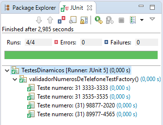
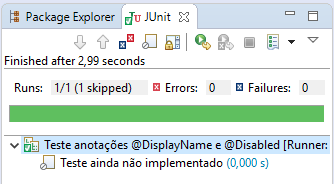
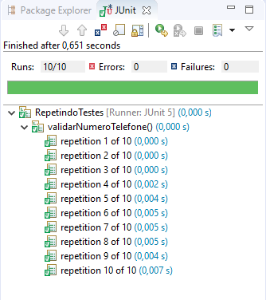
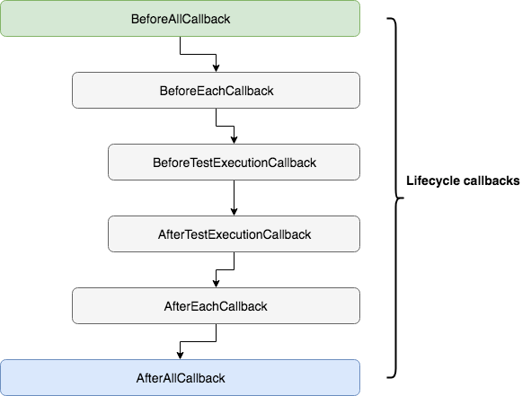

## Novos recursos JUnit 5


### Introdução

O JUnit 5 trouxe consigo uma série de novos recursos, dentre eles temos:

 - Testes dinâmicos com a anotação @TestFactory
 - Testes de Exceptions 
 - Anotação @DisplayName 
 - Anotação @Disabled
 - Anotação @RepeatedTest (n)
 - Testes aninhados com a anotação @Nested 
 - Anotação @ExtendWith e extensões personalizadas


### Criando testes dinâmicos com a anotação @TestFactory

Os testes dinâmicos do JUnit 5 permitem declarar e executar casos de teste gerados em tempo de execução. Ao contrário dos testes estáticos, que definem um número fixo de casos de teste no tempo de compilação, os testes dinâmicos permitem definir dinamicamente os casos de teste no tempo de execução.

Testes dinâmicos podem ser gerados por um método Factory anotado com **@TestFactory**.

Exemplo de uso:

```java
import static org.junit.jupiter.api.DynamicTest.dynamicTest;

import java.util.Arrays;
import java.util.List;
import java.util.stream.Stream;

import org.junit.jupiter.api.Assertions;
import org.junit.jupiter.api.DynamicTest;
import org.junit.jupiter.api.TestFactory;
import org.springframework.boot.test.context.SpringBootTest;

@SpringBootTest
public class TestesDinamicos {

	@TestFactory
	public Stream<DynamicTest> validadorNumerosDeTelefoneTestFactory() {
		
		List<String> numeros = Arrays.asList("31 3333-3333", "31 3535-3535", "(31) 98877-2020", "(31) 89977-4565");
		
		return numeros
				.stream()
				.map(numero -> dynamicTest("Teste numero: " + numero, () -> Assertions.assertTrue(validarNumeroDeTelefone(numero))));
		
	}
	
	public boolean validarNumeroDeTelefone(String numero) {
		String regex = "(\\(?\\d{2}\\)?\\s)?(\\d{4,5}\\-\\d{4})";
		return numero.matches(regex);
	}
	
}
```

O resultado da execução deste teste será semelhante a isso:



Outros exemplos de uso podem ser encontrados [neste]( https://github.com/junit-team/junit5/blob/master/documentation/src/test/java/example/DynamicTestsDemo.java ) e [neste link]( https://www.programcreek.com/java-api-examples/index.php?api=org.junit.jupiter.api.TestFactory).


### Testando exceptions

Se necessário podemos realizar uma asserção que espere uma exception, este é o caso do método **assertThrows** da classe **Assertions**.

Abaixo um simples exemplo de uso:

```java
import org.junit.jupiter.api.Assertions;
import org.junit.jupiter.api.Test;
import org.springframework.boot.test.context.SpringBootTest;

@SpringBootTest
public class TestandoExceptions {

	@Test
	public void shouldThrowException() {
	    Throwable exception = Assertions.assertThrows(UnsupportedOperationException.class, () -> {
	      throw new UnsupportedOperationException("Not supported");
	    });
	    Assertions.assertEquals(exception.getMessage(), "Not supported");
	}
	
	@Test
	public void assertThrowsException() {
	    String str = null;
	    Assertions.assertThrows(IllegalArgumentException.class, () -> {
	      Integer.parseInt(str);
	    });
	}
	
}
```


### Anotações @DisplayName e @Disabled

A anotação **@DisplayName** altera o nome de exibição de algum método ou classe de teste, já a anotação **@Disabled** faz com que um método ou classe de teste seja desativado.

Observe o seguinte trecho de código:

```java
import org.junit.jupiter.api.Disabled;
import org.junit.jupiter.api.DisplayName;
import org.junit.jupiter.api.Test;
import org.springframework.boot.test.context.SpringBootTest;

@SpringBootTest
@DisplayName("Teste anotações @DisplayName e @Disabled")
public class TesteDisplayNameEDisabled {

	@Test
	@DisplayName("Teste ainda não implementado")
	@Disabled
	public void testShowSomething() {
		
	}
	
}
```

Neste trecho de código estamos alterando o nome de exibição do método **testShowSomething** para **Teste ainda não implementado** utilizando a anotação **@DisplayName**, além disso estamos desativando a execução deste teste com o anotação **@Disabled**.

Podemos verificar o resultado da execução deste teste logo abaixo:




### Repetindo testes com a anotação @RepeatedTest (n)

Esta anotação permite a *repetição* de um determinado teste “n” vezes, onde n deve ser substituído pelo número de repetições desejada do método que será testado.

Podemos utilizar da seguinte forma:

```java
import org.junit.jupiter.api.Assertions;
import org.junit.jupiter.api.RepeatedTest;

public class RepetindoTestes {
	
	@RepeatedTest(10)
	public void validarNumeroTelefone() {
		// esse teste será executado 10 vezes
		
		String regex = "(\\(?\\d{2}\\)?\\s)?(\\d{4,5}\\-\\d{4})";
		String telefoneFixo = "(31) 3030-4040";
		String telefoneCelular = "(31) 99558-2040";
		Assertions.assertTrue(telefoneFixo.matches(regex));
		Assertions.assertTrue(telefoneCelular.matches(regex));
	}
	
}
```

O resultado da execução será algo semelhante a isto:




### Criando testes aninhados com a anotação @Nested 

 Eventualmente, queremos testar uma classe que possui vários métodos, cuja execução depende do estado interno do objeto. Para alguns testes, precisamos inicializar esse objeto de determinado modo; em outros testes, a configuração deve ser diferente para que o uso de outro método seja possível. Podemos criar vários métodos na mesma classe de teste, o que pode tornar o entendimento um pouco confuso; outra abordagem possível seria criar testes separados e agrupá-los em uma suite. O fato é que esses testes fazem parte do mesmo contexto, que é o objeto sendo testado, e queremos que eles rodem em conjunto. O JUnit 5 introduziu uma maneira elegante de resolver esse cenário: a anotação @Nested. 

```java
import static org.junit.jupiter.api.Assertions.assertEquals;
import static org.junit.jupiter.api.Assertions.assertFalse;
import static org.junit.jupiter.api.Assertions.assertThrows;
import static org.junit.jupiter.api.Assertions.assertTrue;

import java.util.EmptyStackException;
import java.util.Stack;

import org.junit.jupiter.api.BeforeEach;
import org.junit.jupiter.api.DisplayName;
import org.junit.jupiter.api.Nested;
import org.junit.jupiter.api.Test;

public class TesteAninhado {

    private Stack<String> stack;

    @Test
    @DisplayName("is instantiated with new Stack()")
    void isInstantiatedWithNew() {
        new Stack<>();
    }

    @Nested
    @DisplayName("when new")
    class WhenNew {

        @BeforeEach
        void createNewStack() {
            stack = new Stack<>();
        }

        @Test
        @DisplayName("is empty")
        void isEmpty() {
            assertTrue(stack.isEmpty());
        }

        @Test
        @DisplayName("throws EmptyStackException when popped")
        void throwsExceptionWhenPopped() {
            assertThrows(EmptyStackException.class, () -> stack.pop());
        }

        @Test
        @DisplayName("throws EmptyStackException when peeked")
        void throwsExceptionWhenPeeked() {
            assertThrows(EmptyStackException.class, () -> stack.peek());
        }

        @Nested
        @DisplayName("after pushing an element")
        class AfterPushing {

            String anElement = "an element";

            @BeforeEach
            void pushAnElement() {
                stack.push(anElement);
            }

            @Test
            @DisplayName("it is no longer empty")
            void isNotEmpty() {
                assertFalse(stack.isEmpty());
            }

            @Test
            @DisplayName("returns the element when popped and is empty")
            void returnElementWhenPopped() {
                assertEquals(anElement, stack.pop());
                assertTrue(stack.isEmpty());
            }

            @Test
            @DisplayName("returns the element when peeked but remains not empty")
            void returnElementWhenPeeked() {
                assertEquals(anElement, stack.peek());
                assertFalse(stack.isEmpty());
            }
        }
    }
}
```

Caso queira se aprofundar nas regras de criação de testes aninhados consulte este [link]( https://www.petrikainulainen.net/programming/testing/junit-5-tutorial-writing-nested-tests/ ).


###  Anotação @ExtendWith e extensões personalizadas 

A anotação **@ExtendWith** nos permite utilizar extensões personalizadas durante o ciclo de vida de nossos testes com o JUnit 5.

O JUnit 5 fornece para nossas extensões retornos de chamada que podem ser usados para explorar os eventos do ciclo de vida dos testes. O modelo de extensão fornece várias interfaces para estender os testes em vários pontos do ciclo de vida de execução do teste: 



Vamos ilustrar isso com um pequeno exemplo. 

Dentro do pacote **com.exemplo.junit5** crie um novo pacote chamado **extensions**, utilizaremos este pacote para criar nossas extensão personalizada e um teste utilizando esta extensão.

Crie uma classe chamada **TestLifeCycleExtensions** dentro de nosso pacote **com.exemplo.junit5.extensions** que acabamos de criar e insira o seguinte conteúdo nesta classe:

```java
import org.junit.jupiter.api.extension.*;

public class TestLifeCycleExtensions implements 
					BeforeAllCallback,
					BeforeEachCallback,
					BeforeTestExecutionCallback, 
					AfterTestExecutionCallback, 
					AfterEachCallback, 
					AfterAllCallback {
 
    @Override
    public void beforeAll(ExtensionContext context) {
        log("BeforeAllCallback");
    }
 
    @Override
    public void beforeEach(ExtensionContext context) {
        log("BeforeEachCallback");
    }
 
    @Override
    public void beforeTestExecution(ExtensionContext context) {
        log("BeforeTestExecutionCallback");
    }
 
    @Override
    public void afterTestExecution(ExtensionContext context) {
        log("AfterTestExecutionCallback");
    }
 
    @Override
    public void afterEach(ExtensionContext context) {
        log("AfterEachCallback");
    }
 
    @Override
    public void afterAll(ExtensionContext context) {
        log("AfterAllCallback");
    }
 
    private void log(String logText) {
        System.out.println(logText);
    }
	
}
```

Observe que criamos uma classe que implementa todos Lifecycle callbacks que mostramos acima. Agora criaremos uma classe de teste para utilizar esta extensão, novamente no pacote **com.examplo.junit5.extensions** crie uma classe chamada **TestLifeCycleExtensionTest** e insira o seguinte conteúdo nela:

```java
import org.junit.jupiter.api.*;
import org.junit.jupiter.api.extension.ExtendWith;
 
@ExtendWith(TestLifeCycleExtensions.class)
public class TestLifeCycleExtensionTest {
	
    @BeforeAll
    public static void beforeAll() {
        System.out.println("Dentro de @BeforeAll");
    }
 
    @BeforeEach
    public void beforeEach() {
        System.out.println("Dentro de @BeforeEach");
    }
 
    @Test
    public void primeiroTeste() {
        System.out.println("Dentro do primeiro teste");
    }
 
    @Test
    public void segundoTeste() {
        System.out.println("Dentro do segundo teste");
    }
 
    @AfterEach
    public void afterEach() {
        System.out.println("Dentro de @AfterEach");
    }
 
    @AfterAll
    public static void afterAll() {
        System.out.println("Dentro de @AfterAll");
    }
    
}
```

Ao executarmos nossa classe **TestLifeCycleExtensionTest** teremos um resultado semelhante a este:

```
BeforeAllCallback
Dentro de @BeforeAll
BeforeEachCallback
Dentro de @BeforeEach
BeforeTestExecutionCallback
Dentro do primeiro teste
AfterTestExecutionCallback
Dentro de @AfterEach
AfterEachCallback
BeforeEachCallback
Dentro de @BeforeEach
BeforeTestExecutionCallback
Dentro do segundo teste
AfterTestExecutionCallback
Dentro de @AfterEach
AfterEachCallback
Dentro de @AfterAll
AfterAllCallback
```

Caso deseja explorar mais as extensões personalizadas do JUnit 5 leia este [artigo]( https://www.swtestacademy.com/junit-5-extensions/).