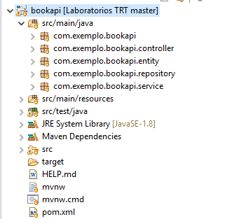

## Testes Mock com Mockito, JUnit e SpringBoot

### Introdução

Uma das características fundamentais de testes de unidade é isolar determinado componente e testar seus métodos da melhor forma possível. Em alguns casos isso não é possível pois muitas vezes dependemos de um serviço externo ou dependemos de uma camada de persistência para executar os testes de alguns componentes.

Imagine que você precisa testar um código que faz acesso à uma camada de persistência por meio de um DAO/Repository. 

Para esse código funcionar em produção, é necessário que algum mecanismo de persistência esteja disponível. Para o código de testes de unidade isso é impraticável: ele vai ficar lento, mais complexo, vai perder o isolamento.
Uma solução para este caso seria simular o acesso à camada de persistência, isso seria possível utilizando Mocks.

De maneira geral, para facilitar o entendimento, mocks são objetos criados para simular, de forma controlada, determinados comportamentos de objetos reais.


### Mockito

O Mockito é um framework popular para criação de Mocks, utilizaremos ele para os exemplos deste laboratório.

Para instalar o Mockito em um projeto maven é bem simples, basta inserir as seguintes dependências ao arquivo pom.xml:

```xml
<!-- https://mvnrepository.com/artifact/org.mockito/mockito-core -->
<dependency>
    <groupId>org.mockito</groupId>
    <artifactId>mockito-core</artifactId>
    <version>3.1.0</version>
    <scope>test</scope>
</dependency>

<!-- https://mvnrepository.com/artifact/org.mockito/mockito-junit-jupiter -->
<dependency>
    <groupId>org.mockito</groupId>
    <artifactId>mockito-junit-jupiter</artifactId>
    <version>3.1.0</version>
    <scope>test</scope>
</dependency>
```


As versões mais novas do SpringBoot já contém essas dependências autocontidas na dependência **spring-boot-starter-test**, com isso basta adicionar a seguinte dependência ao seu arquivo pom.xml para utilizar o Mockito com o SpringBoot:

```xml
<dependency>
	<groupId>org.springframework.boot</groupId>
	<artifactId>spring-boot-starter-test</artifactId>
	<scope>test</scope>
	<exclusions>
		<exclusion>
			<groupId>org.junit.vintage</groupId>
			<artifactId>junit-vintage-engine</artifactId>
		</exclusion>
	</exclusions>
</dependency>
```


### Aplicação de exemplo

Neste laboratório utilizaremos o projeto de uma API de Livros que pode ser baixado neste [link](./codigo/BookApi.zip)

Após baixar o projeto de exemplo extraia e o importe no o eclipse. 

Nossa aplicação de exemplo terá um estrutura semelhante a esta:



Este projeto possui um Controller que recebe nossas requisições HTTP e realiza leitura e gravação de nossas informações em uma base de dados H2.


### Criando nosso primeiro teste Mock

Neste exemplo iremos testar a classe **BookService** que nada mais é do que um serviço mapeia alguns dos métodos de nossa classe **BookRepository**.

Em um cenário comum ao chamar qualquer método da classe **BookService** nossa aplicação seria obrigada a realizar acesso a nossa camada de persistência que em si realiza acesso a nossa base de dados H2, porém ao fazer isso estaríamos perdendo nosso isolamento de código pois estaríamos acessando recursos de nossa camada de persistência.

Para contornar este problema podemos utilizar o Mockito para criar um Mock de nossa camada de persistência e atribuir a ela alguns comportamentos esperados para determinadas chamadas de método.

Antes de iniciarmos o exemplo observe a estrutura da classe **BookService**:

```java
import java.util.List;
import java.util.Optional;

import org.springframework.beans.factory.annotation.Autowired;
import org.springframework.stereotype.Service;

import com.exemplo.bookapi.entity.Book;
import com.exemplo.bookapi.repository.BookRepository;

@Service
public class BookService {

	@Autowired
	private BookRepository bookRepository;
	
	
	public List<Book> getAllBooks() {
		List<Book> books = (List<Book>) bookRepository.findAll();
		return books;
	}
	
	public Optional<Book> getBookById(int id) {
		return bookRepository.findById(id);
	}

	public Book saveBook(Book book) {
		return bookRepository.save(book);
	}
		
	public void deleteBook(int id) {
		bookRepository.deleteById(id);
	}
		
}
```

Note que ela possui uma dependência com a classe **BookRepository** que realiza acesso a camada de persistência de nossa aplicação. 

Para isolar o teste da classe **BookService** iremos criar um Mock da dependência **BookService** conforme o exemplo abaixo:

```java
import static org.junit.jupiter.api.Assertions.assertEquals;

import java.util.ArrayList;
import java.util.List;

import org.junit.jupiter.api.BeforeEach;
import org.junit.jupiter.api.Test;
import org.mockito.InjectMocks;
import org.mockito.Mock;
import org.springframework.boot.test.context.SpringBootTest;

import com.exemplo.bookapi.entity.Book;
import com.exemplo.bookapi.repository.BookRepository;
import com.exemplo.bookapi.service.BookService;

@SpringBootTest
public class BookServiceTest {

	@Mock
	BookRepository bookRepository;
	
	@InjectMocks
	BookService bookService;
	
	List<Book> books;
	
	@BeforeEach
	public void setup() {
		books = new ArrayList();
		
		books.add(new Book(1, "Coração de Tinta", "12345"));
		books.add(new Book(2, "A Bússola de ouro", "23456"));
		books.add(new Book(3, "Casos de Uso Eficazes", "34567"));
		books.add(new Book(4, "Padrões de Projeto", "45678"));
		
        // Atribuindo comportamento ao nosso objeto Mockado.
		Mockito.when(bookRepository.findAll()).thenReturn(books);
	}
	
	@Test
	public void testeGetAllBooks() {
		assertEquals(books, bookService.getAllBooks());
	}
	
}
```

No exemplo acima possuímos duas novas anotações e um novo método, são eles:

* **@Mock**: Esta anotação cria um objeto Mock ao qual devemos atribuir em seguida os comportamentos esperados para este objeto. Poderíamos também substituir a anotação **@Mock**, pela anotação **@Spy**, a diferença entre elas é que a anotação **@Spy** cria uma instância que pode executar os métodos reais do objeto e ainda realizar o Mock de comportamentos desse objeto.
* **@InjectMocks**: Esta anotação cria uma instância da classe alvo e injeta nela os objetos Mocks criados através da anotação @Mock
* **Mockito.when()**: É um método do Mockito que nos permite atribuir comportamentos ao nosso objeto Mock, com o retorno deste invocamos o método **thenReturn**() no qual definimos o que será retornado por este método.

Observe que em nosso método **setup**() estamos dizendo ao Mockito através do método **Mockito.when(0** que quando o método **findAll()** de nosso objeto Mock **BookRepository** for invocado deverá ser retornada a lista de livros que definimos em nosso método de **setup**.

O Mockito funciona desta forma, criamos um Mock de uma dependência interna da classe que iremos testar, atribuímos comportamentos a este objeto Mock e por fim injetamos o objeto Mockado em nosso objeto que será testado através da anotação **@InjectMocks**.


No exemplo abaixo possuímos atribuímos novos métodos de teste a nossa classe **BookServiceTest**, explicaremos alguns novos métodos logo adiante.

```java
import static org.junit.jupiter.api.Assertions.assertEquals;

import java.util.ArrayList;
import java.util.List;
import java.util.Optional;

import org.junit.jupiter.api.BeforeEach;
import org.junit.jupiter.api.Test;
import org.mockito.Mockito;
import org.mockito.invocation.InvocationOnMock;
import org.mockito.InjectMocks;
import org.mockito.Mock;
import org.springframework.boot.test.context.SpringBootTest;

import com.exemplo.bookapi.entity.Book;
import com.exemplo.bookapi.repository.BookRepository;
import com.exemplo.bookapi.service.BookService;

@SpringBootTest
public class BookServiceTest {

	@Mock
	BookRepository bookRepository;
	
	@InjectMocks
	BookService bookService;
	
	List<Book> books;
	Book bookTesteUpdate;
	Book novoLivro;
	
	@BeforeEach
	public void setup() {
		books = new ArrayList();
		
		books.add(new Book(1, "Coração de Tinta", "12345"));
		books.add(new Book(2, "A Bússola de ouro", "23456"));
		books.add(new Book(3, "Casos de Uso Eficazes", "34567"));
		books.add(new Book(4, "Padrões de Projeto", "45678"));
		
		bookTesteUpdate = new Book(2, "A Bússola de ouro - 2ºReimpressão", "67890");
		novoLivro = new Book(5, "Discover to Deliver", "08978");
		
		// Atribuindo comportamentos ao nosso objeto Mockado.
		Mockito.when(bookRepository.findAll()).thenReturn(books);
		
		Mockito.when(bookRepository.findById(1)).thenReturn(Optional.of(books.get(0)));
		Mockito.when(bookRepository.findById(2)).thenReturn(Optional.of(books.get(1)));
		Mockito.when(bookRepository.findById(3)).thenReturn(Optional.of(books.get(2)));

		Mockito.when(bookRepository.findById(4)).thenAnswer((InvocationOnMock invocation) -> {
			
			Integer id = invocation.getArgument(0);
			System.out.println("Buscando livro de ID: " + id);
			return Optional.of(books.get(3));
			
		});
		
		Mockito.when(bookRepository.save(bookTesteUpdate)).thenReturn(bookTesteUpdate);	
		Mockito.when(bookRepository.save(novoLivro)).thenReturn(novoLivro);

		Mockito.doAnswer((InvocationOnMock invocation) -> {
			
			Integer id = invocation.getArgument(0);
			System.out.println("Deletando livro de ID: " + id);
			return null;
			
		}).when(bookRepository).deleteById(Mockito.anyInt());
		
	}
	
	@Test
	public void testeGetAllBooks() {
		assertEquals(books, bookService.getAllBooks());
	}
	
	@Test
	public void testeGetBookById() {
		assertEquals(books.get(0), bookService.getBookById(1).get());
		assertEquals(books.get(1), bookService.getBookById(2).get());
		assertEquals(books.get(2), bookService.getBookById(3).get());
		assertEquals(books.get(3), bookService.getBookById(4).get());		
	}
	

	@Test
	public void testeAddBook() {
		assertEquals(novoLivro, bookService.saveBook(novoLivro));
	}
	
	public void testeUpdateBook() {
		assertEquals(bookTesteUpdate, bookService.saveBook(bookTesteUpdate));
	}
	
	@Test
	public void testeDeleteBook() {
		
		Mockito.verify(bookRepository, Mockito.never()).deleteById(1);
		bookService.deleteBook(1);
		Mockito.verify(bookRepository, Mockito.times(1)).deleteById(1);
		
		Mockito.verify(bookRepository, Mockito.never()).deleteById(10);
		bookService.deleteBook(10);
		Mockito.verify(bookRepository, Mockito.times(1)).deleteById(10);
		
	}
	
}
```

Neste exemplo utilizamos o método **when** da classe **Mockito** para atribuir novos comportamentos ao nosso objeto **bookRepository**. Além disso possuímos 2 novos métodos do Mockito, sendo eles:

* **Mockito.doAnswer**() e **Mockito.thenAnswer**:  Às vezes, você precisa executar algumas ações com os argumentos passados para o método, por exemplo, adicionar alguns valores, fazer alguns cálculos ou até modificá-los. Estes métodos fornecem a interface de resposta que está sendo executada no momento em que o método é chamado, essa interface permite que você interaja com os parâmetros por meio de um argumento do tipo **InvocationOnMock**. Além disso, o valor de retorno do método de resposta será o valor de retorno do método simulado.

  A diferença entre eles é que o **Mockito.doAnswer** é utilizado para Mockar métodos que possuem retorno do tipo void.

* **Mockito.verify**(): Verifica quantas vezes um determinado método foi invocado em um objeto Mockado.

* **Mockito.never**(): Utilizado em conjunto com o método **Mockito.verify**() para verificar se determinado método nunca foi invocado até o determinado momento.
* **Mockito.times**(): Utilizado em conjunto com o método **Mockito.verify**() para indicar que determinado método foi executado N vezes.
* **Mockito.anyInt**(): Indica que o método que o receber pode receber qualquer valor inteiro, existem diversas variações deste método como **Mockito.anyDouble**(), **Mockito.String**(), **Mockito.anyObject**(), entre outros.


Além deste possuímos alguns outros métodos do Mockito que podemos utilizar como:

*  **Mockito.doThrow()** : usado basicamente quando você deseja lançar uma exceção quando um método está sendo chamado dentro de um objeto simulado. Exemplo:

  ```java
  Mockito.
    doThrow(IllegalArgumentException.class)
      .when(validationService)
      .validateEntity(Matchers.any(AnyObjectClass.class));
  ```

*  **Mockito.doReturn()** : Usado quando você deseja enviar um valor de retorno quando um método é executado. Normalmente é usado em objetos Mockados pela anotação **@Spy**. Exemplo:

  ```java
  Mockito
      .doReturn(myReturn)
        .when(myService)
        .doSomething();
  ```

* **Mockito.doNothing**(): Este método diz ao Mockito para não realizar nenhuma ação quando determinado método for executado. Normalmente é executado em método com retorno void.

  Exemplo:

  ```java
  Mockito.doNothing().when(bookRepository).deleteById(Mockito.anyInt());
  ```

  

