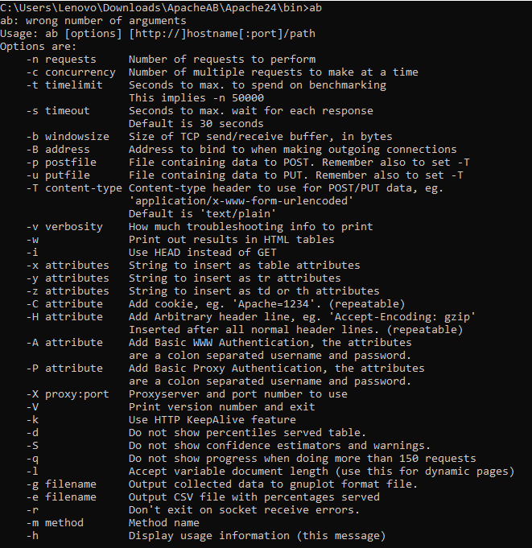
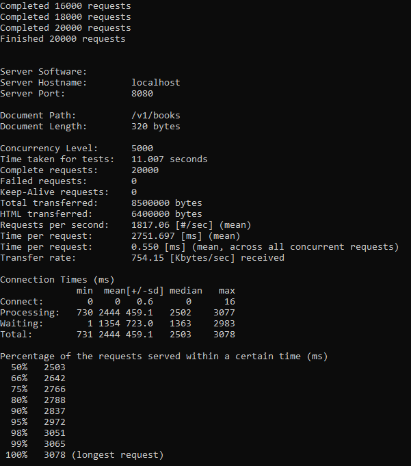

## Testes de performance com Apache AB

### Introdução

 O **ApacheBench** (**ab**) é uma solução gratuita que pode auxiliar na realização de testes de performance em aplicações Web. Este utilitário de linha de comando pode ser empregado em cenários simulando múltiplos usuários concorrentes. 


### Instalação no Linux

Para realizar a instalação no Linux basta executar os seguintes comandos:

```java
apt-get update
apt-get install apache2-utils
apt-get install apache2
```

Para validar sua instalação digite o seguinte comando:

```java
ab -V
```

A saída será semelhante a isso:

```text
This is ApacheBench, Version 2.3 <$Revision: 1604373 $>
Copyright 1996 Adam Twiss, Zeus Technology Ltd, http://www.zeustech.net/
Licensed to The Apache Software Foundation, http://www.apache.org/
```


### Instalação no Windows

Para utilizar o ApacheBench no Windows será necessário, primeiramente, obter uma distribuição do servidor Apache para este sistema operacional.

Nos testes deste laboratório utilizaremos a versão 2.4.20 do Apache Server, a qual foi baixada a partir deste [link]( https://www.apachelounge.com/download/?source=post_page-----5d948d0443b8---------------------- ), o mesmo também pode ser encontrado em nosso repositório no seguinte [link](./utilitario/).

Extraia o conteúdo de nosso zip e navegue até a seguinte pasta: **Apache24/bin/**

Abra um terminal nesta pasta e execute o seguinte  comando:

```java
ab
```

Ao executar este comando você verá algo semelhante a isto:



Na imagem acima vimos todas as opções disponíveis para utilização do Apache AB.

Mantenha este terminal aberto, o utilizaremos na próximas etapa.


### Realizando nosso primeiro testes de performance

Para este teste utilizaremos nossa Api de livros no qual trabalhamos no laboratório anterior.

Caso seja necessário você poderá baixar o projeto neste [link](../Mockito/codigo/BookApi.zip).

Após importar o projeto no eclipse o execute o seguinte comando no terminal que abrimos no tópico anterior:

```java
ab -n 20000 -c 5000 -k -r -s 20 http://localhost:8080/v1/books
```

*  -n 20000 = Representa o número de requisições, no caso 20000 requisições. 
* -c 5000 = Representa o número de concorrências, ou seja, requisições simultâneas 
* -k = Habilita o recurso HTTP KeepAlive, *ou seja* , execute várias solicitações dentro de uma sessão HTTP. O padrão é não KeepAlive. 
* -r =  Indica ao Apache AB para não sair do soquete e receber erros.
* -s = Número máximo de segundos para aguardar antes do tempo limite do soquete. O padrão é 30 segundos. Disponível na versão 2.4.4 e posterior. 
* E por ultimo o endereço IP do serviço web no formato **http://hostname:port/path**


Após executar este comando você receberá um retorno semelhante a este:



 A lista a seguir descreve os valores retornados pelo utilitário :

* **Server Software**:  O valor, se houver, retornou no cabeçalho HTTP do servidor da primeira resposta bem-sucedida. Isso inclui todos os caracteres no cabeçalho do início ao ponto em que um caractere com valor decimal 32 (principalmente: um espaço ou CR / LF) é detectado. 
* **Server Hostname**:  O endereço DNS ou IP fornecido na linha de comando 
* **Server Port**:  A porta ao qual AB está se conectando. Se nenhuma porta for fornecida na linha de comando, o padrão será 80 para http e 443 para https. 
* **Document Path**:  O URI da solicitação analisado a partir da string da linha de comandos. 
* **Document Lenght**:  Esse é o tamanho em bytes do primeiro documento retornado com sucesso. Se o comprimento do documento for alterado durante o teste, a resposta será considerada um erro. 
* **Concurrency Level**:  O número de clientes simultâneos usados durante o teste 

* **Time taken for tests**:  Este é o tempo decorrido desde o momento em que a primeira conexão do soquete é criada até o momento em que a última resposta é recebida 

* **Complete requests**:  O número de respostas bem-sucedidas recebidas 

* **Failed requests**:  O número de requisições que foram considerados uma falha. Se o número for maior que zero, outra linha será impressa mostrando o número de solicitações que falharam devido à conexão, leitura, comprimento incorreto do conteúdo ou exceções. 

* **Keep-Alive requests**:  O número de conexões que resultaram em solicitações Keep-Alive 

* **Total transferred**:  O número total de bytes recebidos do servidor. Esse número é essencialmente o número de bytes enviados pela conexão. 

* **HTML transferred**:  O número total de bytes de documento recebidos do servidor. Este número exclui bytes recebidos em cabeçalhos HTTP 

* **Requests per second**:  Este é o número de solicitações por segundo. Este valor é o resultado da divisão do número de solicitações pelo tempo total gasto 

* **Time per request**: empo por solicitação

  O tempo médio gasto por solicitação. O primeiro valor é calculado com a fórmula, `concurrency * timetaken * 1000 / done` enquanto o segundo valor é calculado com a fórmula `timetaken * 1000 / done`

* **Transfer rate**:  A taxa de transferência calculada pela fórmula `totalread / 1024 / timetaken` 